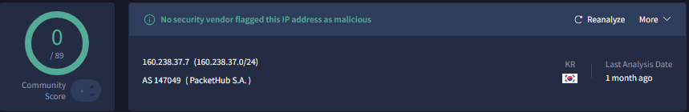
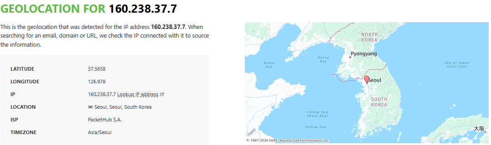
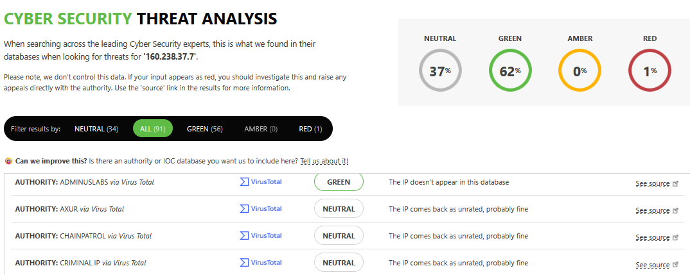

### Introduction

This write-up documents my investigation of the Google_Cloud_Incident Sherlock challenge on Hack The Box. Rather than serving as a step-by-step guide on how to complete the challenge, these notes focus more on how I personally approached the investigation. This particular Sherlock was rated as “Hard,” although it only included one `.json` file and was relatively easy to complete after gaining a basic understanding of Google Cloud Audit Logs. In these notes, I’m going to briefly explain the structure of the JSON file and highlight which fields were relevant to the investigation.

This was my first cloud-focused Sherlock, so it was another learning experience for me. Even though it was rated as Hard, it was actually a great intro to this category of Sherlocks and took me less than an hour to complete. Since June 2026, I’ve also been working as a cybersecurity analyst at a fintech company, so my free time has been more limited. That’s mainly why I’ve been slacking on these write-ups recently and completing fewer of them than I did before graduating (in case anyone was wondering lol).

### Objective

My primary objectives for this investigation were to:
- Identify the compromised Google Cloud identity
- Determine which actions the attacker performed or attempted
- Collect and correlate evidence supporting each finding

### Tools Used

Super simple setup for this one:
- VS Code
- Python
- Google & AI (research on Google Cloud Audit logs & Scripting)

<br>

# Google_Cloud_Incident Sherlock - DFIR Write-up

**Hack The Box Initial information:**

A developer accidentally committed a Google Cloud identity’s key to a public repository. You’ve been tasked with investigating an attacker using the compromised identity attached to the exposed key to perform some nefarious activities.

<br>

## Review of gcp.json

Before starting the actual investigation, I first needed to understand what the `gcp.json` file contained. This ended up being the majority of the battle for this Sherlock. The file looks a little overwhelming at first, but once I figured out which fields answered the basic investigative questions: who, what, where, and whether it worked - the challenge became pretty dang simple.

The file contains Google Cloud Audit Logs. These logs keep a record of important activity inside a Google Cloud environment, such as enabling services, creating virtual machines, modifying firewall rules, and accessing other cloud resources.

In a real-world investigation, these logs can help an analyst determine:

- Which account performed an action
- Where the request came from
- What the account attempted to do
- Which cloud resource was targeted
- Whether the request succeeded or failed
- When the activity occurred

This log contains 17 `protoPayload` entries. Each `protoPayload` acts as the main container for an event and holds the metadata describing who performed the action, what they did, where it came from, and whether it succeeded.

### `authenticationInfo` | Who performed the action?

The `authenticationInfo` section identifies the user or service account responsible for the request.

The most useful fields are:

- `principalEmail` - The email address of the account
- `principalSubject` - The full identity that performed the action
- `serviceAccountKeyName` - The service-account key used to authenticate, when available

### `requestMetadata` | Where did it come from?

The `requestMetadata` section provides information about the source of the request.

Two useful fields are:

- `callerIp` - The IP address that sent the request
- `callerSuppliedUserAgent` - Information about the tool or application used

This can provide additional context about how the account was being used.

### `methodName` | What did the account try to do?

The `methodName` field describes the API action being requested. This was one of the most useful fields in the entire file because it gives a direct description of what occurred.

For example:

```text
v1.compute.instances.insert
```

This can be broken down pretty easily:

- `compute` - The action involved Google Compute Engine
- `instances` - The targeted resource was a virtual machine instance
- `insert` - The request attempted to create that resource

Other entries follow the same general pattern. A method ending in `firewalls.insert`, for example, represents an attempt to create a firewall rule.

### `resourceName` | What was targeted?

The `resourceName` field identifies the specific Google Cloud resource involved in the request.

For a virtual machine, the value may look similar to:

```text
projects/[PROJECT]/zones/[ZONE]/instances/[INSTANCE-NAME]
```

This makes it possible to identify the project, zone, resource type, and name of the targeted instance. It can also be used to connect multiple log entries involving the same resource.

### `authorizationInfo` | Was the account allowed to do it?

The `authorizationInfo` section shows which permission Google checked and whether that permission was granted.

The important fields are:

- `permission` - The permission required for the action
- `granted` - Whether the account had that permission

One important detail is that `granted: true` does not mean the action was successfully completed. It only means the account was authorized to try it. The request could still fail afterward for another reason.

### `status` | Did the request work?

The `status` section shows whether the request encountered an error.

The most useful fields are:

- `code` - The numeric error code
- `message` - A description of why the request failed

A status code of 0 means the action succeeded. If the code is anything other than 0, something went wrong. Reading the message field or doing a Google quick search for the code can help explain why the action failed.

This field is important because there is a major difference between an attacker **attempting** an action and successfully completing it.

### `operation` | Is this the beginning or end of the action?

Some Google Cloud actions take time to complete and can generate multiple log entries.

The `operation` section helps connect those entries:

- `id` - A shared ID used to track the same operation
- `first: true` - The operation started
- `last: true` - The operation finished

**Because of this, two log entries do not always mean two separate actions occurred. They may represent the beginning and end of the same operation. Grouping entries by their operation ID helps avoid counting the same action more than once.**

### `timestamp` | When did it happen? (duh)

These timestamps are stored in UTC and can be used to build a timeline or compare activity with other sources of evidence.

### Simplifying the Log Structure

Instead of trying to understand every field in the file, I found it easier to reduce each log entry to a few basic questions:

- **Who?** `authenticationInfo`
- **From where?** `requestMetadata`
- **What did they try to do?** `methodName`
- **What did they target?** `resourceName`
- **Were they allowed?** `authorizationInfo`
- **Did it work?** `status` and `operation`
- **When?** `timestamp`

Once I understood how these fields worked together, the file became MUCH easier to read. From that point, the investigation was mostly a matter of following the activity tied to the suspicious identity and determining which actions were attempted versus successfully completed.

<br>

## Identifying the Compromised Identity

My first goal was to identify which Google Cloud identity had been compromised and determine what IP address was associated with its activity.

Since the useful values were stored inside each `protoPayload`, I supplied AI with the structure of the log entries and had it quickly create a Python script that extracts every `principalSubject` and `callerIp` value from the file. The script removes duplicates and saves the identities and IP addresses into separate text files.

I’ll include the script in this GitHub repository for anyone who wants to use it with other Google Cloud Audit Logs.

### Compromised Identity

After running the script against `gcp.json`, only one identity was returned:

```text
serviceAccount:main-dev@cyberwox-labs.iam.gserviceaccount.com
```

This is a Google Cloud service account. Service accounts are normally used by applications, scripts, virtual machines, and other automated services to interact with Google Cloud resources.

Since this was the only identity in the logs, the investigation became MUCH easier because I didn’t need to filter out activity from other accounts.

### Associated IP Address

The script also returned only one unique source IP address:

```text
160.238.37.7
```

I confirmed both findings manually by opening `gcp.json` in VS Code and using `Ctrl+F`.

Searching for the identity returned 17 matches, and searching for the IP address also returned 17 matches. I then searched for `protoPayload`, which returned 17 matches as well. This confirmed that all 17 events in the file were associated with the same service account and source IP address.

This honestly surprised me because the Sherlock was rated as “Hard.” In my experience, harder Sherlocks usually contain a crazy amount of noise, multiple users, and several unrelated IP addresses that need to be filtered out. That wasn’t the case here.

Once the structure of the audit logs was understood, there was only one identity and one IP address to follow. This is another reason why I think this Sherlock is a good introduction to cloud DFIR.

### IP Geolocation

I submitted `160.238.37.7` to VirusTotal for additional context. VirusTotal geolocated the IP address to South Korea but did not report any malicious or suspicious detections.



I also checked the IP using DracoEye, which confirmed the South Korean geolocation and displayed a hit near Seoul on its map. Unlike VirusTotal, DracoEye reported malicious or suspicious activity associated with the IP.





This difference is a good reminder to always cross-reference threat-intelligence sources and take IP reputation with a grain of salt. A newly used attacker IP may not have been reported yet, especially if the activity is recent or limited. On the other hand, legitimate cloud, hosting, VPN, or CDN addresses may be flagged because another user previously performed malicious activity through the same infrastructure.

IP addresses can also be shared by multiple users through gateways or reassigned to different customers over time. This means an IP could be associated with malicious activity one day and used by a legitimate customer later.

Because of these factors, an IP being flagged does not automatically make it malicious, and an IP with no detections is not automatically safe. OSINT and threat-intelligence tools are best used for enrichment and context. Their results should always be compared with the actual behavior observed in the logs.

<br>

## Firewall Rule Creation

After identifying the compromised identity and associated IP address, I moved on to reviewing what actions were performed by the attacker. One of those actions involved creating a Google Cloud firewall rule.

Since this was a small dataset, I mainly used `Ctrl+F` in VS Code to search for fields and keywords related to firewall activity. Normally, I would not use this approach with a large log source. In a real-world environment, I would probably use Python to extract firewall-related events tied to the suspicious identity or IP address and then investigate that smaller dataset.

However, because this file only contained 17 events and Google Cloud Audit Logs were still new to me, manually clicking around was actually helpful. Instead of trying to script every answer as quickly as possible, I wanted to become more familiar with the structure of the logs and understand where the useful information was stored.

Searching for `firewall` returned 16 matches, but this does not mean there were 16 separate firewall events. The word appears several times within the same event, including inside fields such as:

- `methodName`
- `resourceName`
- `permission`
- `@type`
- URLs inside the request and response

After reviewing the matching entries, I found only two actual firewall log entries. Both used the following method:

```text
v1.compute.firewalls.insert
```

These two entries were connected by the same `operation.id`, meaning they represented the beginning and completion of the same firewall creation operation rather than two separate attempts.

The request details contained the name and priority of the rule:

```json
"name": "default",
"priority": "0"
```

This identified the firewall rule as:

- **Rule name:** `default`
- **Priority:** `0`

Searching for `default` returned 28 matches, but this was also much broader than it initially appeared. The word was repeated throughout the firewall entries and was also used as the name of the default VPC network referenced by other events. This is why manually reviewing the surrounding fields was still necessary instead of treating every search result as a separate action.

The name `default` is fairly generic and could help the rule blend in with other normal-looking cloud resources. However, it is also a common name within Google Cloud environments, so the name alone is not enough to determine malicious intent. The surrounding identity, timing, request details, and other activity provide the important context.

The priority was set to `0`, which is the highest possible priority value for a Google Cloud firewall rule. Google evaluates lower numbers before higher ones, meaning a matching rule with priority `0` can take precedence over lower-priority rules. [Google Cloud firewall rule documentation](https://docs.cloud.google.com/firewall/docs/firewalls)

This part of the investigation was a good example of why keyword-search counts need context. A search may return several matches, but many of those matches can come from repeated values inside the same event. The important part is identifying the actual API method, reviewing the request data, and using the `operation.id` to determine how many unique actions occurred.

<br>

## GCE Instance Creation Attempts

The next part of the investigation focused on answering three questions:

- How many times did the attacker attempt to create a GCE instance?
- Where did the attacker first attempt to create it?
- Were any of the instances successfully created?

### Number of Creation Attempts

The API method used to create a Google Compute Engine instance is:

```text
v1.compute.instances.insert
```

Searching for this method returned six events. On the surface, this could make it look like the attacker attempted to create six separate instances. However, each creation attempt generated two events: one when the operation started and another when it finished.

The following fields helped separate these events:

- `operation.id` — Connects events belonging to the same operation
- `operation.first` — Marks the beginning of the operation
- `operation.last` — Marks the completion of the operation

The six events contained these operation IDs:

```text
operation-1688110046883-5ff53bfafaddb-2cd1c7a5-8dc78956
operation-1688110046883-5ff53bfafaddb-2cd1c7a5-8dc78956

operation-1688110085588-5ff53c1fe44a3-fb89c288-83d40ab4
operation-1688110085588-5ff53c1fe44a3-fb89c288-83d40ab4

operation-1688110241119-5ff53cb437c9b-db4ce97e-e9d505d8
operation-1688110241119-5ff53cb437c9b-db4ce97e-e9d505d8
```

Once the duplicate IDs were grouped together, there were only three unique operations. This confirmed that the attacker made **three separate attempts** to create a GCE instance, not six.

This was another example of why keyword-search results need additional context. Searching for the correct API method found the relevant events, but the `operation.id` field was needed to determine how many unique actions actually occurred.

### First Location Targeted

Searching for the first operation ID narrowed the results down to the first creation attempt. The target location was shown in several fields, including:

```json
"resourceLocation": {
  "currentLocations": [
    "europe-west1-b"
  ]
}
```

The same location also appeared inside `protoPayload.resourceName`:

```text
projects/cyberwox-labs/zones/europe-west1-b/instances/crypto-instance
```

The first location targeted by the attacker was therefore:

```text
europe-west1-b
```

Technically, `europe-west1-b` is a **zone**, while `europe-west1` is the wider region containing that zone. The next creation attempt also targeted `europe-west1-b`, while the third attempt targeted `us-east1-b`.

| Attempt | Targeted zone    | Instance name     |
| ------- | ---------------- | ----------------- |
| 1       | `europe-west1-b` | `crypto-instance` |
| 2       | `europe-west1-b` | `crypto-instance` |
| 3       | `us-east1-b`     | `crypto-instance` |

The name `crypto-instance` also gives some insight into what the attacker may have intended to use the virtual machine for.

### Were Any Instances Created?

To determine whether the attempts succeeded, I reviewed the completion event for each operation. All three contained the following status:

```json
"status": {
  "code": 8,
  "message": "QUOTA_EXCEEDED"
}
```

Status code `8` means the requested resource quota was exceeded. The additional details showed that the affected quota was:

```text
GPUS_ALL_REGIONS
```

Each request attempted to attach an NVIDIA Tesla P100 GPU, but the project’s GPU quota was set to `0`. Because of this, Google Cloud rejected all three creation attempts.

The initial events showed the operations as `PENDING` or `RUNNING`, but this only meant that Google Cloud had started processing the requests. The events marked with `operation.last: true` contained the final result, which was `QUOTA_EXCEEDED` in all three cases.

Based on these logs:

- **GCE creation attempts:** 3
- **First targeted zone:** `europe-west1-b`
- **Successful instance creations:** 0

The attacker tried three times—twice in `europe-west1-b` and once in `us-east1-b`—but none of the instances were created because the project did not have any available GPU quota.

<br>

## Final Assessment

Based on the available Google Cloud Audit Logs, the investigation supports the following conclusions:

- The `main-dev@cyberwox-labs.iam.gserviceaccount.com` service account was the only identity associated with the activity in the provided logs.
- All 17 events originated from the same IP address, `160.238.37.7`, which was geolocated to South Korea through VirusTotal and DracoEye.
- The account successfully enabled the IAM and Cloud Resource Manager APIs.
- The attacker successfully created a firewall rule named `default` with a priority of `0`.
- The attacker attempted to create a network named `default`, but the request failed because the resource already existed.
- Three separate attempts were made to create a GCE instance named `crypto-instance`.
- The first two instance creation attempts targeted `europe-west1-b`, while the final attempt targeted `us-east1-b`.
- Each instance requested an NVIDIA Tesla P100 GPU, suggesting the attacker may have intended to use the instances for cryptocurrency mining or another GPU-intensive task.
- All three instance creation attempts failed with status code `8` and the message `QUOTA_EXCEEDED` because the project’s available GPU quota was set to 0.

Although the attacker successfully made changes within the Google Cloud environment, there is no evidence in the provided logs that any GCE instances were successfully created. The available evidence suggests that the compromised service account was used to prepare the environment and attempt to deploy a GPU-enabled virtual machine, but the lack of available GPU quota prevented the deployment from completing.

## Next Steps

If this were a live incident, my next steps would include:

- Disable the compromised service-account key and revoke active credentials.
- Review and reduce the service account’s IAM permissions.
- Remove the unauthorized firewall rule.
- Search for additional activity tied to the account, key, and source IP.
- Confirm that no other cloud resources were successfully created.
- Review billing data for signs of cryptomining or unexpected usage.
- Replace long-lived keys and create detections for suspicious cloud activity.
