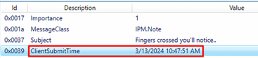

### Introduction

This write-up documents my investigation of the HeartBreaker Sherlock challenge on Hack The Box. Rather than serving as a step-by-step guide on how to complete the challenge, these notes focus on how I approached this investigation, what artifacts I chose to analyze, and how I reasoned with the evidence as it becomes uncovered.

I've been trying to treat these Sherlock challenges like real-world DFIR scenarios, prioritizing investigative flow, artifact correlation, and validating assumptions instead of just flying through the answers.

### Objective

My primary objective of this investigation was to determine:
- How the initial compromise occurred
- What actions were taken on the system afterward
- What evidence exists to support user interaction, execution, and post-execution activity

### Tools Used

These are the tools I found useful in this investigation:
- OST/PST email analysis tools (Autopsy should work here too)
- DB Browser for SQLite
- Zimmerman Suite (EvtxeCmd, PECmd, MFTECmd, Timeline Explorer)

 

# HeartBreaker Sherlock - DFIR Write-up

**Hack The Box Initial information:**

Delicate situation alert! The customer has just been alerted about concerning reports
indicating a potential breach of their database, with information allegedly being circulated on
the darknet market. As the Incident Responder, it's your responsibility to get to the bottom of
it. Your task is to conduct an investigation into an email received by one of their employees,
comprehending the implications, and uncovering any possible connections to the data
breach. Focus on examining the artifacts provided by the customer to identify significant
events that have occurred on the victim's workstation.

**Initial Email Review**

To kick off my investigation, I focused on email artifacts based on the initial context provided by Hack The Box, which indicated the presence of a suspicious email. Since email is a very common initial access vector, this was the most logical place to begin when looking for how the compromise may have started.

At this stage, I wanted to understand whether social engineering played a role in the incident and, if so, what technique may have been used. This could include the user clicking a malicious link, downloading a malicious attachment acting as a trojan, or being tricked into sharing sensitive information.

To validate this, I reviewed the available .ost file and looked for indicators such as:
- Suspicious sender addresses
- Malicious attachments or embedded links
- Email content prompting user interaction or urgency

Navigating to: `C:\Users\ash.williams\AppData\Local\Microsoft\Outlook`

This directory includes the user's Outlook data file: `ashwilliams012100@gmail.com.ost`

To review its contents, I loaded the OST file into an OST/PST viewer (I would recommend finding a better OST/PST tool). The user's inbox contained five emails, one of which immediately stood out as suspicious.

Suspicious Email Details:
- Sender: `ImSecretlyYours@proton.me`
- Received: `2024-03-13 03:37 AM`
- Attachment: `4YourEyesOnly.tiff`
- Embedded URL: `http://44.206.187.144:9000/Superstar_MemberCard.tiff.exe`

The email body used romantic language to entice the user into clicking on an embedded link and downloading a so-called "digital membership card" for access to a private club, where the threat actor and the victim can meet. Aligning with common social engineering techniques designed to lower user suspicion and encourage the execution of an attachment.

**Malicious File Execution**

Based on my assumption that the malicious content was executed locally, the next step was to validate program execution.

Prefetch artifacts were examined to confirm:
- Whether the suspected executable was run
- How many times might it have been executed
- Approximate execution timestmap

Prefetch showed that the file `Superstar_MembershipCard.tiff.exe` was downloaded and executed from the user's Downloads directory.

Execution:
- File Path: `C:\Users\ash.williams\Downloads\Superstar_MemberCard.tiff.exe`
- Execution Time: `2024-03-13 10:45:02`

To gain further context around this file, I correlated Prefetch with `$MFT`, `$J`, and `Microsoft-Windows-Sysmon/Operational.evtx` logs to find the file's location on the device, scan for any file creation or modification activity, as well as any child processes spawned by the executable.

This activity aligns with MITRE ATT&CK T1204 - User Execution, as the malware required user interaction to run.

**Post-Execution User Activity**

Following execution, browser artifacts were examined to determine whether any follow-up activity occurred, such as:
- Accessing malicious URLs
- Downloading additional payloads
- User-driven browsing tied to the incident

FireFox History SQLite database provided further insight into post-compromise activity and helped identify whether the browser played a role beyond the initial infection.

Although there was no evidence indicating further downloads, two searches were particularly notable in relation to this incident:
- "what to wear to impress date"
- "Superstar café membership"

These searches stood out as they appeared to be legitimate, user-initiated activity, indicating that the user was successfully socially engineered, while showing no evidence of attacker-driven behavior or additional malicious downloads following the initial compromise.

**Malicious Outbound Email Activity**

While analyzing the malicious file's activity within the Sysmon logs, I observed evidence of interaction with Outlook.exe. This finding prompted me to revisit the mailbox artifact reviewed earlier in the investigation.

Upon re-examining the mailbox, I identified an email in the Sent Items folder that was an exact copy of the original malicious email received by the victim. This message had been sent to the victim's entire contact list, totaling 58 recipients.

When correlating with the Outlook.exe interaction and message metadata such as ClientSubmitTime, the evidence suggests this outbound email activity was malware-driven rather than user-initiated, indicating the compromised host was used to propagate additional malicious emails.

Email Metadata Findings:
- `ClientSubmitTime`: `2024-03-13 10:47:51`
- Recipients: 58 contacts (excluding the victim's own address)

This provides supporting evidence that the malware was capable of accessing the user's email data and automating outbound messages, increasing the scope of potential compromise.

**Credential Exposure Observations**

While reviewing the OST file, I identified a draft email created by the user that contained AWS credentials. Although this email was never sent, it remained stored locally within the mailbox data.

Earlier in the investigation, Sysmons logs indicated that the malicious file interacted with `Outlook.exe` and successfully sent another malicious email from the user's machine, demonstrating that the malware had access to the user's mailbox data. When considered together, this suggests that the contents of the OST file, including the unsent draft containing AWS credentials, were likely within the scope of what the malware could access.

While no direct evidence of credential exfiltration was observed in the available artifacts, the presence of sensitive credentials within an accessible mailbox significantly increases the potential impact of the compromise and represents a serious security risk.

**Host-Level Behavioral Analysis**

While continuing the analysis of Sysmon logs, I focused on what activity occurred on the system following the execution of `Superstar_Membership.tiff.exe`. At this stage, my goal was to identify which system resources and legitimate binaries the malware interacted with after gaining execution.

During this review, I observed that the malicious process interacted with `nltest.exe`, a legitimate Windows utility commonly used to query domain-related information, such as domain controllers and trust relationships.

Although `nltest.exe` is a legitimate administrative tool, it is frequently abused by threat actors during post-compromise activity to gather information about the domain environment. Its presence in this context suggests the malware may have been attempting to enumerate domain infrastructure or assess the surrounding environment as part of the post-execution behavior and further internal reconnaissance.

**Network Activity & Tool Staging**

During Sysmon analysis, I observed `Superstar_Membership.tiff.exe` making a DNS query to `us.softradar.com`. Shortly after this query, a new directory appeared on the system at: `C:\Users\Public\HelpDesk-Tools\`

This directory contained:
- `license.txt`
- `readme.txt`
- `WinSCP.exe` (a free, open source file manager and secure file transfer client for Windows)
- `WinSCP.com`
- `maintenanceScript.txt`

The naming and structure of this directory closely resemble a legitimate toolkit. In the context of this investigation, this behavior is consistent with MITRE ATT&CK T1036 – Masquerading, where threat actors attempt to blend malicious activity with normal system administration.

When correlated with the DNS request and file creation timestamps, the evidence suggests these tools were staged on the system following the network activity, indicating internal preparation for potential follow-up activity.

**Data Staging & Compression Indicators**

While continuing the review of Sysmon logs, I observed `Superstar_MemberCard.tiff.exe` accessing a large number of sensitive files located within publicly accessible directories. At this stage of the investigation, the focus was on identifying activity consistent with data collection or preparation for exfiltration.

Further correlation showed that at least 26 files were accessed before the creation of the following compressed archives:
- `WB-WS-01.zip`
- `WinSCP.zip`

This pattern of file access followed by the creation of compressed archives suggests that these files were intentionally staged and packaged together. This behavior is consistent with pre-exfiltration preparation, where data is collected into one directory and then compressed before being transferred off the system and through the network.

**Data Exfiltration Evidence**

Further Sysmon Event ID 1 (Process Creation) analysis revealed the execution of WinSCP using the following command:
- `C:\Users\Public\HelpDesk-Tools\WinSCP.com /script=C:\Users\Public\HelpDesk-Tools\maintenanceScript.txt`

Shortly after this execution, Sysmon Event ID 3 (Network Connection) logged an outbound connection initiated by `WinSCP.exe`:
- Destination IP: `35.169.66.138`
- Timestamp: `2024-03-13 10:45:29`
- Executable: `WinSCP.exe`

The use of a `.txt` script file to store WinSCP commands suggests an attempt to automate file transfer activity while blending malicious behavior into what appears to be legitimate administrative tooling. When viewed alongside earlier file staging and compression activity, this pattern strongly supports the conclusion that WinSCP was used as part of data exfiltration.

**Final Assessment**

Based on the available artifacts, the investigation supports the following conclusions:
- The user was successfully socially engineered into executing a malicious binary
- The malware propagated via outbound email using the victim's account.
- Additional tools were staged to facilitate data collection and transfer.
- Sensitive files were likely compressed and exfiltrated using WinSCP

While not every stage of exfiltration is directly observable, the consistency across host, email, and network artifacts strongly supports a full compromise of the workstation.

**Next Steps**

If this were a live incident, my next steps would include:
- Credential rotation (email and cloud accounts)
- Scoping other recipients of the malicious email
- Network-wide search for related indicators
- Reviewing proxy and firewall logs for additional exfiltration attempts
- Host reimaging and post-incident hardening

