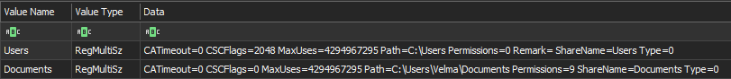
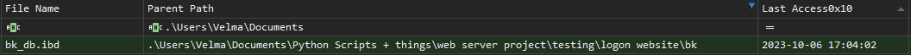
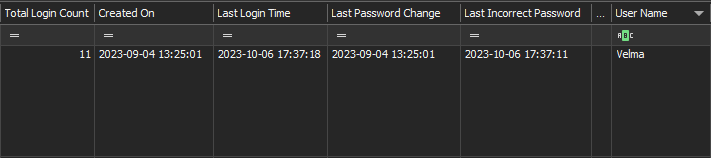
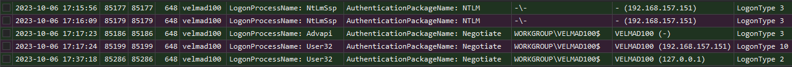
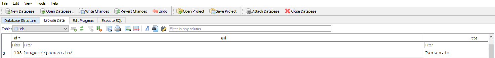
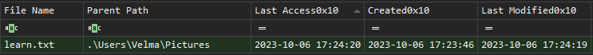

### Introduction

This write-up documents my investigation of the **Jinkies** Sherlock challenge on Hack The Box. Rather than serving as a step-by-step guide on how to complete the challenge like other write-ups, these notes focus more on how I personally approached this investigation, what artifacts I chose to analyze, how I reasoned with the evidence, and how I documented my findings for others to read.

I've been trying to treat these Sherlock challenges like real-world DFIR scenarios, prioritizing my own investigative flow, artifact correlation, and validating assumptions instead of just flying through the answers.

### Objective

My primary objective of this investigation was to determine:

- Whether the user actually shared her Documents folder
- Whether sensitive files or intellectual property were exposed through that share
- Whether the attacker used exposed credentials to access the workstation
- What actions were taken on the system afterward
- What evidence supports possible data theft or exfiltration

### Tools Used

These are the tools I found useful in this investigation:

- Timeline Explorer
- EvtxECmd
- MFTExplorer
- DB Browser for SQLite
- Registry Explorer

 

# Jinkies Sherlock - DFIR Write-up

**Hack The Box Initial Information**

You’re a third-party IR consultant and your manager has just forwarded you a case from a small-sized startup named **cloud-guru-management ltd**. They’re currently building out a product with their team of developers, but the CEO has received word-of-mouth communications that their intellectual property has been stolen and is in use elsewhere. The user in question says she may have accidentally shared her Documents folder, and she stated that she thinks the attack happened on the **6th of October**. The user also said she was away from her computer on this day. There is not a great deal more information from the company besides this. An investigation was initiated into the root cause of this potential theft from Cloud-guru; however, the team failed to discover the cause of the leak. They gathered preliminary evidence through a KAPE triage, and it was up to me to figure out the story of how this all came to be. **Note:** This Sherlock requires an element of OSINT, and players may need to interact with third-party services on the internet.

 

**Initial Network Share Review**

To kick off my investigation, I wanted to confirm the user's claim that she "may have accidentally shared her Documents folder."

Members on the team suspected that the user likely right-clicked her Documents folder and selected the **Give access** or **Share** option. That seemed like the most logical place to start, because if the Documents folder was exposed over the network, it could explain how sensitive project files or intellectual property were accessed without needing malware execution first.

It's worth noting that online reports state that in some instances of sharing a user's Documents folder, it can have some sort of a "cascade effect" and result in the entire `C:\Users` parent directory being shared to ensure that the specific network path is reachable.

The best place to verify network shares is within the SYSTEM registry hive. Using Eric Zimmerman's Registry Explorer, I reviewed the SYSTEM registry and navigated to: `ControlSet001\Services\LanmanServer\Shares`. This location shows the system's non-administrative network shares.

Looking within `LanmanServer\Shares`, I observed that the following folders had been shared to the network: `C:\Users\Velma\Documents, C:\Users`

This confirmed that Velma's Documents folder was shared, and more importantly, that the broader `C:\Users` directory was also exposed. At this point, there was registry evidence showing that sensitive user directories were actually shared over the network.

*Shared Folder's within `\LanmanServer\Shares\`:*

 

**Credential Exposure Observations**

After confirming the network shares, I focused on what sensitive content may have been exposed through those shared folders.

Within Velma's shared Documents folder, there was a subdirectory for a web server project: `C:\Users\Velma\Documents\web server project\testing\logon website\bk`. Inside that directory was a raw database dump file: `bk_db.ibd`. This file appeared to contain data from the web application's user table. The data included a large amount of personal information, including full names, Gmail addresses, and plaintext passwords.

To get a concrete number of users associated with the leak, I used the following PowerShell command to count how many Gmail addresses were present within the dump: `(Select-String -Path "your_file.ibd" -Pattern "@gmail" -AllMatches).Matches.Count`

This showed me that there were **216 user credentials** located within the dump file, including the user in question, **Velma Dinkley**.

One of the most important findings was Velma's password information inside the exposed data dump. The NTLM hash associated with Velma's exposed password was: `967452709ae89eaeef4e2c951c3882ce`

My next step was to determine whether the password in the data dump was likely still the same password Velma used for her workstation.

To validate this, I reviewed Velma's account information within the SAM registry hive: `SAM\Domains\Account\Users`

The key timestamps were:

- `bk_db.ibd` last observable modification: `2023-09-20 13:05:17`
- Velma's last password change: `2023-09-04 13:25:01`

Since Velma's password was last changed **16 days before** the last observable modification time of the database dump, it is likely that the password exposed in the dump was still the same password being used for Velma's workstation. I would be careful not to say this proves the exact password was used, but the evidence strongly supports that the attacker had access to credentials that were still valid at the time of the intrusion. This points toward **MITRE ATT&CK T1078 - Valid Accounts**.

*Raw data dump file seen within $MFT with a last access date of October 6th, the same day the user Velma was not working:*

*Velma's last password change located with the SAM registry, located at: `SAM\Domains\Account\Users:*

 

**Valid Account Compromise**

After identifying that Velma's credentials were exposed, I wanted to verify whether someone had authenticated to the workstation using her account using them.

Analysis of `Security.evtx` with **Event ID 4624** and a filter for `TargetUserName: Velma` showed multiple successful logon events. The event that stood out occurred at: `2023-10-06 17:17:23`

This event was classified as: `Logon Type 3 - Network Logon`

A Type 3 logon indicates that the authentication occurred over the network rather than through an interactive console session.

This timing was important because Velma reported being away from her workstation that day. Given that context, a successful network logon using Velma's account is highly suspicious and suggests that an external or unauthorized system authenticated to the host using valid credentials. This behavior is consistent with an attacker leveraging exposed credentials to remotely access the system, likely through SMB or another network-accessible service.

*Suspicious Network Logons for Velma's account*

 

**Post-Authentication User Activity**

After confirming suspicious authentication, I reviewed what happened immediately after the attacker logged into Velma's workstation.

Based on `Sysmon-Operational.evtx`, the attacker ran the following command in `cmd.exe` shortly after logging in: `whoami`. The command was executed at approximately: `2023-10-06 17:17:45`

This stood out because `whoami` is commonly used by attackers to confirm which account they are operating as after gaining access to a system. In this case, it aligns with **MITRE ATT&CK T1033 - System Owner/User Discovery**.

Shortly after that, the attacker opened the following file in VS Code: `Version-1.0.1 - TERMINAL LOGIN.py`. The file was opened at approximately: `2023-10-06 17:18:27`

This was a major clue because the attacker appeared to be specifically targeting a web application's login-related source code. That lines up with the overall scenario from Hack The Box, where the company believed their intellectual property had been stolen and was being used elsewhere.

I also checked the PowerShell logs: `PowerShell-Operational.evtx, PowerShell-Admin.evtx, Windows PowerShell.evtx` Although these did not contain evidence of attacker command activity. That made sense because the relevant attacker activity was observed through `cmd.exe` in `Sysmon-Operational.evtx`, not through PowerShell.

 

**Malicious Outbound Web Activity**

While reviewing the attacker activity, I observed that after opening the login-related Python file, the attacker opened Google Chrome and visited: `https://pastes.io/`

Pastes.io is a minimalist pastebin-style platform designed for users to quickly store and share text, code snippets, and logs.

This does not prove by itself that the attacker pasted or exfiltrated the source code, but the sequence of activity is suspicious:

1. The attacker logged in using Velma's account over the network.
2. The attacker ran `whoami` to confirm account context.
3. The attacker opened a web application's login-related Python file in VS Code.
4. The attacker then browsed to a paste site.

Due to the attacker explicitly targeting the web application's login page and then visiting Pastes.io, this activity is strongly consistent with data staging or exfiltration of intellectual property. I do not have direct proof of the exact content transferred to Pastes.io from the local artifacts alone, so I would avoid saying the exfiltration is fully confirmed from this evidence. However, when paired with the CEO's report that the company's intellectual property was being used elsewhere, this activity strongly supports a likely theft scenario.

*Velma's Google Chrome history showing the attacker visiting `pastes.io`*

 

**Data Staging & Exfiltration Indicators**

While reviewing the available evidence, I did not observe the same kind of obvious staging pattern that might appear in other incidents, such as:

- Compressing files into a ZIP archive
- Downloading a file transfer utility
- Creating a staging directory
- Running scripted exfiltration commands

Instead, this case appears to center around direct access to sensitive project files through an exposed share and then likely copying or pasting useful source code into a web-based service.

The most important exfiltration indicators were:

- `C:\Users\Velma\Documents` and `C:\Users` were shared over the network
- `bk_db.ibd` contained sensitive user credential data
- Velma's exposed password was likely still valid
- A suspicious network logon occurred using Velma's account
- The attacker opened a web application's login-related Python file
- The attacker visited Pastes.io immediately afterward
- The CEO had already heard reports that the company's intellectual property was being used elsewhere

Looking at this all together, this supports the assessment that data theft likely occurred, even though the exact contents transferred out of the environment were not directly visible in the local artifacts.

 

**Threat Actor Message**

While there were no other major observable malicious actions taken on the system, a new file appeared in Velma's Pictures directory: `C:\Users\Velma\Pictures\learn.txt`

The contents of the file stated:

`lol check your drivers next time idiot
signed by: pwnmaster12`

I thought this behavior was pretty irregular compared to the rest of the attacker's activity. Their earlier actions, such as targeted access to a web application file followed by browsing to a paste site, suggested a focused objective consistent with data collection or exfiltration.

The creation of a taunting message feels more opportunistic or immature. It doesn't really fit cleanly with the rest of their activity, in my opinion.

 

**Final Assessment**

Based on the available artifacts, my investigation supports the following conclusions:

- Velma's `Documents` folder was shared to the network.
- The broader `C:\Users` directory was also shared, likely increasing exposure.
- A raw database dump inside the shared project directory exposed 216 user credentials.
- Velma's exposed password was likely still valid at the time of the intrusion.
- An attacker authenticated to the workstation using Velma's account via a network logon.
- The attacker ran `whoami`, opened a login-related source code file in VS Code, and then visited Pastes.io.
- A taunting file named `learn.txt` was created, signed by `pwnmaster12`.
- The evidence strongly supports a likely intellectual property theft or corporate espionage incident.

While the available artifacts do not directly show the exact content copied to Pastes.io, the consistency across registry shares, credential exposure, authentication logs, process execution, browser history, and the original CEO report strongly supports that the attacker used exposed credentials to access Velma's workstation and likely steal project-related source code.

**Next Steps**

If this were a real live incident, my next steps would include:

- Disable the exposed network shares immediately.
- Reset Velma's password and review her account for additional suspicious logons.
- Rotate all credentials found inside `bk_db.ibd`.
- Investigate whether any of the 216 exposed users reused passwords elsewhere.
- Review firewall, proxy, DNS, and browser artifacts for additional activity involving `pastes.io`.
- Search for activity tied to `pwnmaster12` through approved OSINT methods.
- Review other hosts for connections from the suspicious source system.
- Audit the development project for exposed secrets, credentials, or hardcoded keys.
- Move sensitive project data and credentials out of user-accessible folders.
- Implement stricter controls around Windows file sharing and developer secrets management.
- Notify leadership that the evidence supports likely IP theft, while being clear that the exact exfiltrated content is not fully visible from the local artifacts alone.
